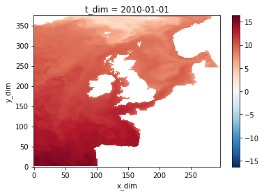
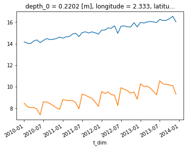
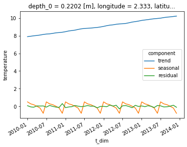

# Seasonal decomposition
Example usage of the seasonal decomposition function
## Overview
A function within the Process_data class that will decompose time series into trend, seasonal and residual components. The function is a wrapper that adds functionality to the `seasonal_decompose` function contained in the [statsmodels](https://www.statsmodels.org/stable/generated/statsmodels.tsa.seasonal.seasonal_decompose.html#statsmodels.tsa.seasonal.seasonal_decompose) package to make it more convenient for large geospatial datasets.

Specifically:
1) Multiple time series spread across multiple dimensions, e.g. a gridded dataset, can be processed. The user simply passes in an xarray DataArray that has a "t_dim" dimension and 1 or more additional dimensions, for example gridded spatial dimensions
2) Masked locations, such as land points, are handled
3) A [dask](https://www.dask.org/) wrapper is applied to the function that 
    a) supports lazy evaluation
    b) allows the dataset to be easily seperated into chunks so that processing can be carried out in parallel (rather than processing every time series sequentially)
4) The decomposed time series are returned as xarray DataArrays within a single coast.Gridded object

## An example
Below is an example using the `coast.Process_data.seasonal_decomposition` function with the example data. Note that we will artifically extend the length of the example data time series for demonstrative purposes.

Begin by importing coast, defining paths to the data, and loading the example data into a gridded object:


```python
import coast
import numpy as np
import xarray as xr

# Path to a data file.
fn_nemo_dat  = "./example_files/coast_example_nemo_data.nc"
# Set path for domain file if required.
fn_nemo_dom  = "./example_files/coast_example_nemo_domain.nc"
# Set path for model configuration file
config = "./config/example_nemo_grid_t.json"

# Read in data (This example uses NEMO data.)
grd = coast.Gridded(fn_nemo_dat, fn_nemo_dom, config=config)
```

The loaded example data only has 7 time stamps, the code below creates a new (fake) extended temperature variable with 48 monthly records. This code is not required to use the function, it is only included here to make a set of time series that are long enough to be interesting.


```python
# create a 4 yr monthly time coordinate array
time_array = np.arange(
    np.datetime64("2010-01-01"), np.datetime64("2014-01-01"), np.timedelta64(1, "M"), dtype="datetime64[M]"
).astype("datetime64[s]")

# create 4 years of monthly temperature data based on the loaded data
temperature_array = (
    (np.arange(0, 48) * 0.05)[:, np.newaxis, np.newaxis, np.newaxis]
    + np.random.normal(0, 0.1, 48)[:, np.newaxis, np.newaxis, np.newaxis]
    + np.tile(grd.dataset.temperature[:-1, :2, :, :], (8, 1, 1, 1))
)

# create a new temperature DataArray
temperature = xr.DataArray(
    temperature_array,
    coords={
        "t_dim": time_array,
        "depth_0": grd.dataset.depth_0[:2, :, :],
        "longitude": grd.dataset.longitude,
        "latitude": grd.dataset.latitude,
    },
    dims=["t_dim", "z_dim", "y_dim", "x_dim"],
)
```

Check out the new data


```python
temperature
```


<div><svg style="position: absolute; width: 0; height: 0; overflow: hidden">
<defs>
<symbol id="icon-database" viewBox="0 0 32 32">
<path d="M16 0c-8.837 0-16 2.239-16 5v4c0 2.761 7.163 5 16 5s16-2.239 16-5v-4c0-2.761-7.163-5-16-5z"></path>
<path d="M16 17c-8.837 0-16-2.239-16-5v6c0 2.761 7.163 5 16 5s16-2.239 16-5v-6c0 2.761-7.163 5-16 5z"></path>
<path d="M16 26c-8.837 0-16-2.239-16-5v6c0 2.761 7.163 5 16 5s16-2.239 16-5v-6c0 2.761-7.163 5-16 5z"></path>
</symbol>
<symbol id="icon-file-text2" viewBox="0 0 32 32">
<path d="M28.681 7.159c-0.694-0.947-1.662-2.053-2.724-3.116s-2.169-2.030-3.116-2.724c-1.612-1.182-2.393-1.319-2.841-1.319h-15.5c-1.378 0-2.5 1.121-2.5 2.5v27c0 1.378 1.122 2.5 2.5 2.5h23c1.378 0 2.5-1.122 2.5-2.5v-19.5c0-0.448-0.137-1.23-1.319-2.841zM24.543 5.457c0.959 0.959 1.712 1.825 2.268 2.543h-4.811v-4.811c0.718 0.556 1.584 1.309 2.543 2.268zM28 29.5c0 0.271-0.229 0.5-0.5 0.5h-23c-0.271 0-0.5-0.229-0.5-0.5v-27c0-0.271 0.229-0.5 0.5-0.5 0 0 15.499-0 15.5 0v7c0 0.552 0.448 1 1 1h7v19.5z"></path>
<path d="M23 26h-14c-0.552 0-1-0.448-1-1s0.448-1 1-1h14c0.552 0 1 0.448 1 1s-0.448 1-1 1z"></path>
<path d="M23 22h-14c-0.552 0-1-0.448-1-1s0.448-1 1-1h14c0.552 0 1 0.448 1 1s-0.448 1-1 1z"></path>
<path d="M23 18h-14c-0.552 0-1-0.448-1-1s0.448-1 1-1h14c0.552 0 1 0.448 1 1s-0.448 1-1 1z"></path>
</symbol>
</defs>
</svg>
<style>/* CSS stylesheet for displaying xarray objects in jupyterlab.
 *
 */

:root {
  --xr-font-color0: var(--jp-content-font-color0, rgba(0, 0, 0, 1));
  --xr-font-color2: var(--jp-content-font-color2, rgba(0, 0, 0, 0.54));
  --xr-font-color3: var(--jp-content-font-color3, rgba(0, 0, 0, 0.38));
  --xr-border-color: var(--jp-border-color2, #e0e0e0);
  --xr-disabled-color: var(--jp-layout-color3, #bdbdbd);
  --xr-background-color: var(--jp-layout-color0, white);
  --xr-background-color-row-even: var(--jp-layout-color1, white);
  --xr-background-color-row-odd: var(--jp-layout-color2, #eeeeee);
}

html[theme=dark],
body.vscode-dark {
  --xr-font-color0: rgba(255, 255, 255, 1);
  --xr-font-color2: rgba(255, 255, 255, 0.54);
  --xr-font-color3: rgba(255, 255, 255, 0.38);
  --xr-border-color: #1F1F1F;
  --xr-disabled-color: #515151;
  --xr-background-color: #111111;
  --xr-background-color-row-even: #111111;
  --xr-background-color-row-odd: #313131;
}

.xr-wrap {
  display: block !important;
  min-width: 300px;
  max-width: 700px;
}

.xr-text-repr-fallback {
  /* fallback to plain text repr when CSS is not injected (untrusted notebook) */
  display: none;
}

.xr-header {
  padding-top: 6px;
  padding-bottom: 6px;
  margin-bottom: 4px;
  border-bottom: solid 1px var(--xr-border-color);
}

.xr-header > div,
.xr-header > ul {
  display: inline;
  margin-top: 0;
  margin-bottom: 0;
}

.xr-obj-type,
.xr-array-name {
  margin-left: 2px;
  margin-right: 10px;
}

.xr-obj-type {
  color: var(--xr-font-color2);
}

.xr-sections {
  padding-left: 0 !important;
  display: grid;
  grid-template-columns: 150px auto auto 1fr 20px 20px;
}

.xr-section-item {
  display: contents;
}

.xr-section-item input {
  display: none;
}

.xr-section-item input + label {
  color: var(--xr-disabled-color);
}

.xr-section-item input:enabled + label {
  cursor: pointer;
  color: var(--xr-font-color2);
}

.xr-section-item input:enabled + label:hover {
  color: var(--xr-font-color0);
}

.xr-section-summary {
  grid-column: 1;
  color: var(--xr-font-color2);
  font-weight: 500;
}

.xr-section-summary > span {
  display: inline-block;
  padding-left: 0.5em;
}

.xr-section-summary-in:disabled + label {
  color: var(--xr-font-color2);
}

.xr-section-summary-in + label:before {
  display: inline-block;
  content: '►';
  font-size: 11px;
  width: 15px;
  text-align: center;
}

.xr-section-summary-in:disabled + label:before {
  color: var(--xr-disabled-color);
}

.xr-section-summary-in:checked + label:before {
  content: '▼';
}

.xr-section-summary-in:checked + label > span {
  display: none;
}

.xr-section-summary,
.xr-section-inline-details {
  padding-top: 4px;
  padding-bottom: 4px;
}

.xr-section-inline-details {
  grid-column: 2 / -1;
}

.xr-section-details {
  display: none;
  grid-column: 1 / -1;
  margin-bottom: 5px;
}

.xr-section-summary-in:checked ~ .xr-section-details {
  display: contents;
}

.xr-array-wrap {
  grid-column: 1 / -1;
  display: grid;
  grid-template-columns: 20px auto;
}

.xr-array-wrap > label {
  grid-column: 1;
  vertical-align: top;
}

.xr-preview {
  color: var(--xr-font-color3);
}

.xr-array-preview,
.xr-array-data {
  padding: 0 5px !important;
  grid-column: 2;
}

.xr-array-data,
.xr-array-in:checked ~ .xr-array-preview {
  display: none;
}

.xr-array-in:checked ~ .xr-array-data,
.xr-array-preview {
  display: inline-block;
}

.xr-dim-list {
  display: inline-block !important;
  list-style: none;
  padding: 0 !important;
  margin: 0;
}

.xr-dim-list li {
  display: inline-block;
  padding: 0;
  margin: 0;
}

.xr-dim-list:before {
  content: '(';
}

.xr-dim-list:after {
  content: ')';
}

.xr-dim-list li:not(:last-child):after {
  content: ',';
  padding-right: 5px;
}

.xr-has-index {
  font-weight: bold;
}

.xr-var-list,
.xr-var-item {
  display: contents;
}

.xr-var-item > div,
.xr-var-item label,
.xr-var-item > .xr-var-name span {
  background-color: var(--xr-background-color-row-even);
  margin-bottom: 0;
}

.xr-var-item > .xr-var-name:hover span {
  padding-right: 5px;
}

.xr-var-list > li:nth-child(odd) > div,
.xr-var-list > li:nth-child(odd) > label,
.xr-var-list > li:nth-child(odd) > .xr-var-name span {
  background-color: var(--xr-background-color-row-odd);
}

.xr-var-name {
  grid-column: 1;
}

.xr-var-dims {
  grid-column: 2;
}

.xr-var-dtype {
  grid-column: 3;
  text-align: right;
  color: var(--xr-font-color2);
}

.xr-var-preview {
  grid-column: 4;
}

.xr-var-name,
.xr-var-dims,
.xr-var-dtype,
.xr-preview,
.xr-attrs dt {
  white-space: nowrap;
  overflow: hidden;
  text-overflow: ellipsis;
  padding-right: 10px;
}

.xr-var-name:hover,
.xr-var-dims:hover,
.xr-var-dtype:hover,
.xr-attrs dt:hover {
  overflow: visible;
  width: auto;
  z-index: 1;
}

.xr-var-attrs,
.xr-var-data {
  display: none;
  background-color: var(--xr-background-color) !important;
  padding-bottom: 5px !important;
}

.xr-var-attrs-in:checked ~ .xr-var-attrs,
.xr-var-data-in:checked ~ .xr-var-data {
  display: block;
}

.xr-var-data > table {
  float: right;
}

.xr-var-name span,
.xr-var-data,
.xr-attrs {
  padding-left: 25px !important;
}

.xr-attrs,
.xr-var-attrs,
.xr-var-data {
  grid-column: 1 / -1;
}

dl.xr-attrs {
  padding: 0;
  margin: 0;
  display: grid;
  grid-template-columns: 125px auto;
}

.xr-attrs dt,
.xr-attrs dd {
  padding: 0;
  margin: 0;
  float: left;
  padding-right: 10px;
  width: auto;
}

.xr-attrs dt {
  font-weight: normal;
  grid-column: 1;
}

.xr-attrs dt:hover span {
  display: inline-block;
  background: var(--xr-background-color);
  padding-right: 10px;
}

.xr-attrs dd {
  grid-column: 2;
  white-space: pre-wrap;
  word-break: break-all;
}

.xr-icon-database,
.xr-icon-file-text2 {
  display: inline-block;
  vertical-align: middle;
  width: 1em;
  height: 1.5em !important;
  stroke-width: 0;
  stroke: currentColor;
  fill: currentColor;
}
</style><pre class='xr-text-repr-fallback'>&lt;xarray.DataArray (t_dim: 48, z_dim: 2, y_dim: 375, x_dim: 297)&gt;
array([[[[        nan,         nan,         nan, ...,         nan,
                  nan,         nan],
         [        nan, 15.41602644, 15.32911238, ...,         nan,
                  nan,         nan],
         [        nan, 15.43067488, 15.82813581, ...,         nan,
                  nan,         nan],
         ...,
         [        nan,         nan,         nan, ...,         nan,
                  nan,         nan],
         [        nan,         nan,         nan, ...,         nan,
                  nan,         nan],
         [        nan,         nan,         nan, ...,         nan,
                  nan,         nan]],

        [[        nan,         nan,         nan, ...,         nan,
                  nan,         nan],
         [        nan, 15.40430769, 15.31739363, ...,         nan,
                  nan,         nan],
         [        nan, 15.41895613, 15.82813581, ...,         nan,
                  nan,         nan],
...
         [        nan,         nan,         nan, ...,         nan,
                  nan,         nan],
         [        nan,         nan,         nan, ...,         nan,
                  nan,         nan],
         [        nan,         nan,         nan, ...,         nan,
                  nan,         nan]],

        [[        nan,         nan,         nan, ...,         nan,
                  nan,         nan],
         [        nan, 17.23080518, 17.24447705, ...,         nan,
                  nan,         nan],
         [        nan, 17.2093208 , 17.03353955, ...,         nan,
                  nan,         nan],
         ...,
         [        nan,         nan,         nan, ...,         nan,
                  nan,         nan],
         [        nan,         nan,         nan, ...,         nan,
                  nan,         nan],
         [        nan,         nan,         nan, ...,         nan,
                  nan,         nan]]]])
Coordinates:
  * t_dim      (t_dim) datetime64[ns] 2010-01-01 2010-02-01 ... 2013-12-01
    depth_0    (z_dim, y_dim, x_dim) float32 0.5 0.5 0.5 0.5 ... 1.5 1.5 1.5 1.5
    longitude  (y_dim, x_dim) float32 ...
    latitude   (y_dim, x_dim) float32 ...
Dimensions without coordinates: z_dim, y_dim, x_dim</pre><div class='xr-wrap' style='display:none'><div class='xr-header'><div class='xr-obj-type'>xarray.DataArray</div><div class='xr-array-name'></div><ul class='xr-dim-list'><li><span class='xr-has-index'>t_dim</span>: 48</li><li><span>z_dim</span>: 2</li><li><span>y_dim</span>: 375</li><li><span>x_dim</span>: 297</li></ul></div><ul class='xr-sections'><li class='xr-section-item'><div class='xr-array-wrap'><input id='section-73e28601-f6f8-49cf-bfd5-e4435aeb6293' class='xr-array-in' type='checkbox' checked><label for='section-73e28601-f6f8-49cf-bfd5-e4435aeb6293' title='Show/hide data repr'><svg class='icon xr-icon-database'><use xlink:href='#icon-database'></use></svg></label><div class='xr-array-preview xr-preview'><span>nan nan nan nan nan nan nan nan ... nan nan nan nan nan nan nan nan</span></div><div class='xr-array-data'><pre>array([[[[        nan,         nan,         nan, ...,         nan,
                  nan,         nan],
         [        nan, 15.41602644, 15.32911238, ...,         nan,
                  nan,         nan],
         [        nan, 15.43067488, 15.82813581, ...,         nan,
                  nan,         nan],
         ...,
         [        nan,         nan,         nan, ...,         nan,
                  nan,         nan],
         [        nan,         nan,         nan, ...,         nan,
                  nan,         nan],
         [        nan,         nan,         nan, ...,         nan,
                  nan,         nan]],

        [[        nan,         nan,         nan, ...,         nan,
                  nan,         nan],
         [        nan, 15.40430769, 15.31739363, ...,         nan,
                  nan,         nan],
         [        nan, 15.41895613, 15.82813581, ...,         nan,
                  nan,         nan],
...
         [        nan,         nan,         nan, ...,         nan,
                  nan,         nan],
         [        nan,         nan,         nan, ...,         nan,
                  nan,         nan],
         [        nan,         nan,         nan, ...,         nan,
                  nan,         nan]],

        [[        nan,         nan,         nan, ...,         nan,
                  nan,         nan],
         [        nan, 17.23080518, 17.24447705, ...,         nan,
                  nan,         nan],
         [        nan, 17.2093208 , 17.03353955, ...,         nan,
                  nan,         nan],
         ...,
         [        nan,         nan,         nan, ...,         nan,
                  nan,         nan],
         [        nan,         nan,         nan, ...,         nan,
                  nan,         nan],
         [        nan,         nan,         nan, ...,         nan,
                  nan,         nan]]]])</pre></div></div></li><li class='xr-section-item'><input id='section-e705bea7-5dda-4e40-ad2a-1ca053dbb438' class='xr-section-summary-in' type='checkbox'  checked><label for='section-e705bea7-5dda-4e40-ad2a-1ca053dbb438' class='xr-section-summary' >Coordinates: <span>(4)</span></label><div class='xr-section-inline-details'></div><div class='xr-section-details'><ul class='xr-var-list'><li class='xr-var-item'><div class='xr-var-name'><span class='xr-has-index'>t_dim</span></div><div class='xr-var-dims'>(t_dim)</div><div class='xr-var-dtype'>datetime64[ns]</div><div class='xr-var-preview xr-preview'>2010-01-01 ... 2013-12-01</div><input id='attrs-5c51ac0c-e128-46e6-b7cc-4879e83974fe' class='xr-var-attrs-in' type='checkbox' disabled><label for='attrs-5c51ac0c-e128-46e6-b7cc-4879e83974fe' title='Show/Hide attributes'><svg class='icon xr-icon-file-text2'><use xlink:href='#icon-file-text2'></use></svg></label><input id='data-f9de55e9-955d-4dcc-88b0-d39229b65214' class='xr-var-data-in' type='checkbox'><label for='data-f9de55e9-955d-4dcc-88b0-d39229b65214' title='Show/Hide data repr'><svg class='icon xr-icon-database'><use xlink:href='#icon-database'></use></svg></label><div class='xr-var-attrs'><dl class='xr-attrs'></dl></div><div class='xr-var-data'><pre>array([&#x27;2010-01-01T00:00:00.000000000&#x27;, &#x27;2010-02-01T00:00:00.000000000&#x27;,
       &#x27;2010-03-01T00:00:00.000000000&#x27;, &#x27;2010-04-01T00:00:00.000000000&#x27;,
       &#x27;2010-05-01T00:00:00.000000000&#x27;, &#x27;2010-06-01T00:00:00.000000000&#x27;,
       &#x27;2010-07-01T00:00:00.000000000&#x27;, &#x27;2010-08-01T00:00:00.000000000&#x27;,
       &#x27;2010-09-01T00:00:00.000000000&#x27;, &#x27;2010-10-01T00:00:00.000000000&#x27;,
       &#x27;2010-11-01T00:00:00.000000000&#x27;, &#x27;2010-12-01T00:00:00.000000000&#x27;,
       &#x27;2011-01-01T00:00:00.000000000&#x27;, &#x27;2011-02-01T00:00:00.000000000&#x27;,
       &#x27;2011-03-01T00:00:00.000000000&#x27;, &#x27;2011-04-01T00:00:00.000000000&#x27;,
       &#x27;2011-05-01T00:00:00.000000000&#x27;, &#x27;2011-06-01T00:00:00.000000000&#x27;,
       &#x27;2011-07-01T00:00:00.000000000&#x27;, &#x27;2011-08-01T00:00:00.000000000&#x27;,
       &#x27;2011-09-01T00:00:00.000000000&#x27;, &#x27;2011-10-01T00:00:00.000000000&#x27;,
       &#x27;2011-11-01T00:00:00.000000000&#x27;, &#x27;2011-12-01T00:00:00.000000000&#x27;,
       &#x27;2012-01-01T00:00:00.000000000&#x27;, &#x27;2012-02-01T00:00:00.000000000&#x27;,
       &#x27;2012-03-01T00:00:00.000000000&#x27;, &#x27;2012-04-01T00:00:00.000000000&#x27;,
       &#x27;2012-05-01T00:00:00.000000000&#x27;, &#x27;2012-06-01T00:00:00.000000000&#x27;,
       &#x27;2012-07-01T00:00:00.000000000&#x27;, &#x27;2012-08-01T00:00:00.000000000&#x27;,
       &#x27;2012-09-01T00:00:00.000000000&#x27;, &#x27;2012-10-01T00:00:00.000000000&#x27;,
       &#x27;2012-11-01T00:00:00.000000000&#x27;, &#x27;2012-12-01T00:00:00.000000000&#x27;,
       &#x27;2013-01-01T00:00:00.000000000&#x27;, &#x27;2013-02-01T00:00:00.000000000&#x27;,
       &#x27;2013-03-01T00:00:00.000000000&#x27;, &#x27;2013-04-01T00:00:00.000000000&#x27;,
       &#x27;2013-05-01T00:00:00.000000000&#x27;, &#x27;2013-06-01T00:00:00.000000000&#x27;,
       &#x27;2013-07-01T00:00:00.000000000&#x27;, &#x27;2013-08-01T00:00:00.000000000&#x27;,
       &#x27;2013-09-01T00:00:00.000000000&#x27;, &#x27;2013-10-01T00:00:00.000000000&#x27;,
       &#x27;2013-11-01T00:00:00.000000000&#x27;, &#x27;2013-12-01T00:00:00.000000000&#x27;],
      dtype=&#x27;datetime64[ns]&#x27;)</pre></div></li><li class='xr-var-item'><div class='xr-var-name'><span>depth_0</span></div><div class='xr-var-dims'>(z_dim, y_dim, x_dim)</div><div class='xr-var-dtype'>float32</div><div class='xr-var-preview xr-preview'>0.5 0.5 0.5 0.5 ... 1.5 1.5 1.5 1.5</div><input id='attrs-73e426ea-9b3c-4905-bc8c-b90a991fb7d3' class='xr-var-attrs-in' type='checkbox' ><label for='attrs-73e426ea-9b3c-4905-bc8c-b90a991fb7d3' title='Show/Hide attributes'><svg class='icon xr-icon-file-text2'><use xlink:href='#icon-file-text2'></use></svg></label><input id='data-706f7534-2a4d-49b2-b047-d51d0d3696a6' class='xr-var-data-in' type='checkbox'><label for='data-706f7534-2a4d-49b2-b047-d51d0d3696a6' title='Show/Hide data repr'><svg class='icon xr-icon-database'><use xlink:href='#icon-database'></use></svg></label><div class='xr-var-attrs'><dl class='xr-attrs'><dt><span>units :</span></dt><dd>m</dd><dt><span>standard_name :</span></dt><dd>Depth at time zero on the t-grid</dd></dl></div><div class='xr-var-data'><pre>array([[[0.5       , 0.5       , 0.5       , ..., 0.5       ,
         0.5       , 0.5       ],
        [0.5       , 0.4975586 , 0.4975586 , ..., 0.10009766,
         0.10009766, 0.5       ],
        [0.5       , 0.4975586 , 0.4975586 , ..., 0.10009766,
         0.10009766, 0.5       ],
        ...,
        [0.5       , 0.10009766, 0.10009766, ..., 0.10009766,
         0.10009766, 0.5       ],
        [0.5       , 0.10009766, 0.10009766, ..., 0.10009766,
         0.10009766, 0.5       ],
        [0.5       , 0.5       , 0.5       , ..., 0.5       ,
         0.5       , 0.5       ]],

       [[1.5       , 1.5       , 1.5       , ..., 1.5       ,
         1.5       , 1.5       ],
        [1.5       , 1.5170898 , 1.5170898 , ..., 0.30029297,
         0.30029297, 1.5       ],
        [1.5       , 1.5170898 , 1.5170898 , ..., 0.30029297,
         0.30029297, 1.5       ],
        ...,
        [1.5       , 0.30029297, 0.30029297, ..., 0.30029297,
         0.30029297, 1.5       ],
        [1.5       , 0.30029297, 0.30029297, ..., 0.30029297,
         0.30029297, 1.5       ],
        [1.5       , 1.5       , 1.5       , ..., 1.5       ,
         1.5       , 1.5       ]]], dtype=float32)</pre></div></li><li class='xr-var-item'><div class='xr-var-name'><span>longitude</span></div><div class='xr-var-dims'>(y_dim, x_dim)</div><div class='xr-var-dtype'>float32</div><div class='xr-var-preview xr-preview'>...</div><input id='attrs-9ed2cc24-cf9c-4b2f-b47b-8ec8dc9f45fd' class='xr-var-attrs-in' type='checkbox' disabled><label for='attrs-9ed2cc24-cf9c-4b2f-b47b-8ec8dc9f45fd' title='Show/Hide attributes'><svg class='icon xr-icon-file-text2'><use xlink:href='#icon-file-text2'></use></svg></label><input id='data-7b74c78a-38d3-4b38-a9a5-4a700b49b991' class='xr-var-data-in' type='checkbox'><label for='data-7b74c78a-38d3-4b38-a9a5-4a700b49b991' title='Show/Hide data repr'><svg class='icon xr-icon-database'><use xlink:href='#icon-database'></use></svg></label><div class='xr-var-attrs'><dl class='xr-attrs'></dl></div><div class='xr-var-data'><pre>[111375 values with dtype=float32]</pre></div></li><li class='xr-var-item'><div class='xr-var-name'><span>latitude</span></div><div class='xr-var-dims'>(y_dim, x_dim)</div><div class='xr-var-dtype'>float32</div><div class='xr-var-preview xr-preview'>...</div><input id='attrs-7106c04a-2484-4eda-a7f8-16b5e9154e56' class='xr-var-attrs-in' type='checkbox' disabled><label for='attrs-7106c04a-2484-4eda-a7f8-16b5e9154e56' title='Show/Hide attributes'><svg class='icon xr-icon-file-text2'><use xlink:href='#icon-file-text2'></use></svg></label><input id='data-7306da0e-e9e7-4c39-a909-104547baa23f' class='xr-var-data-in' type='checkbox'><label for='data-7306da0e-e9e7-4c39-a909-104547baa23f' title='Show/Hide data repr'><svg class='icon xr-icon-database'><use xlink:href='#icon-database'></use></svg></label><div class='xr-var-attrs'><dl class='xr-attrs'></dl></div><div class='xr-var-data'><pre>[111375 values with dtype=float32]</pre></div></li></ul></div></li><li class='xr-section-item'><input id='section-5e239a27-e6e0-43db-a93d-8c1600af0ee6' class='xr-section-summary-in' type='checkbox' disabled ><label for='section-5e239a27-e6e0-43db-a93d-8c1600af0ee6' class='xr-section-summary'  title='Expand/collapse section'>Attributes: <span>(0)</span></label><div class='xr-section-inline-details'></div><div class='xr-section-details'><dl class='xr-attrs'></dl></div></li></ul></div></div>


```python
temperature[0,0,:,:].plot()
```


    <matplotlib.collections.QuadMesh at 0x7fd6340538e0>


    

    


Check out time series at 2 different grid points


```python
temperature[:,0,50,50].plot()
temperature[:,0,200,200].plot()
```


    [<matplotlib.lines.Line2D at 0x7fd62ffaabb0>]


    

    


Create a `coast.Process_data` object, and call the `seasonal_decomposition` function, passing in the required arguments. The first two arguments are:
1. The input data, here the temperature data as an xarray DataArray
2. The number of chuncks to split the data into. Here we split the data into 2 chunks so that the dask scheduler will try to run 4 processes in parallel

The remaining arguments are keyword arguments for the underlying `statsmodels.tsa.seasonal.seasonal_decompose` function, which are documented on the [statsmodels documentation pages](https://www.statsmodels.org/stable/generated/statsmodels.tsa.seasonal.seasonal_decompose.html#statsmodels.tsa.seasonal.seasonal_decompose).  Here we specify:

3. three The type of model, i.e. an additive model
4. The period of the seasonal cycle, here it is 6 months
5. Extrapolate the trend component to cover the entire range of the time series (this is required because the trend is calculated using a convolution filter) 


```python
proc_data = coast.Process_data()
grd = proc_data.seasonal_decomposition(temperature, 2, model="additive", period=6, extrapolate_trend="freq")
```

The returned xarray Dataset contains the decomposed time series (trend, seasonal, residual) as dask arrays


```python
grd.dataset
```


<div><svg style="position: absolute; width: 0; height: 0; overflow: hidden">
<defs>
<symbol id="icon-database" viewBox="0 0 32 32">
<path d="M16 0c-8.837 0-16 2.239-16 5v4c0 2.761 7.163 5 16 5s16-2.239 16-5v-4c0-2.761-7.163-5-16-5z"></path>
<path d="M16 17c-8.837 0-16-2.239-16-5v6c0 2.761 7.163 5 16 5s16-2.239 16-5v-6c0 2.761-7.163 5-16 5z"></path>
<path d="M16 26c-8.837 0-16-2.239-16-5v6c0 2.761 7.163 5 16 5s16-2.239 16-5v-6c0 2.761-7.163 5-16 5z"></path>
</symbol>
<symbol id="icon-file-text2" viewBox="0 0 32 32">
<path d="M28.681 7.159c-0.694-0.947-1.662-2.053-2.724-3.116s-2.169-2.030-3.116-2.724c-1.612-1.182-2.393-1.319-2.841-1.319h-15.5c-1.378 0-2.5 1.121-2.5 2.5v27c0 1.378 1.122 2.5 2.5 2.5h23c1.378 0 2.5-1.122 2.5-2.5v-19.5c0-0.448-0.137-1.23-1.319-2.841zM24.543 5.457c0.959 0.959 1.712 1.825 2.268 2.543h-4.811v-4.811c0.718 0.556 1.584 1.309 2.543 2.268zM28 29.5c0 0.271-0.229 0.5-0.5 0.5h-23c-0.271 0-0.5-0.229-0.5-0.5v-27c0-0.271 0.229-0.5 0.5-0.5 0 0 15.499-0 15.5 0v7c0 0.552 0.448 1 1 1h7v19.5z"></path>
<path d="M23 26h-14c-0.552 0-1-0.448-1-1s0.448-1 1-1h14c0.552 0 1 0.448 1 1s-0.448 1-1 1z"></path>
<path d="M23 22h-14c-0.552 0-1-0.448-1-1s0.448-1 1-1h14c0.552 0 1 0.448 1 1s-0.448 1-1 1z"></path>
<path d="M23 18h-14c-0.552 0-1-0.448-1-1s0.448-1 1-1h14c0.552 0 1 0.448 1 1s-0.448 1-1 1z"></path>
</symbol>
</defs>
</svg>
<style>/* CSS stylesheet for displaying xarray objects in jupyterlab.
 *
 */

:root {
  --xr-font-color0: var(--jp-content-font-color0, rgba(0, 0, 0, 1));
  --xr-font-color2: var(--jp-content-font-color2, rgba(0, 0, 0, 0.54));
  --xr-font-color3: var(--jp-content-font-color3, rgba(0, 0, 0, 0.38));
  --xr-border-color: var(--jp-border-color2, #e0e0e0);
  --xr-disabled-color: var(--jp-layout-color3, #bdbdbd);
  --xr-background-color: var(--jp-layout-color0, white);
  --xr-background-color-row-even: var(--jp-layout-color1, white);
  --xr-background-color-row-odd: var(--jp-layout-color2, #eeeeee);
}

html[theme=dark],
body.vscode-dark {
  --xr-font-color0: rgba(255, 255, 255, 1);
  --xr-font-color2: rgba(255, 255, 255, 0.54);
  --xr-font-color3: rgba(255, 255, 255, 0.38);
  --xr-border-color: #1F1F1F;
  --xr-disabled-color: #515151;
  --xr-background-color: #111111;
  --xr-background-color-row-even: #111111;
  --xr-background-color-row-odd: #313131;
}

.xr-wrap {
  display: block !important;
  min-width: 300px;
  max-width: 700px;
}

.xr-text-repr-fallback {
  /* fallback to plain text repr when CSS is not injected (untrusted notebook) */
  display: none;
}

.xr-header {
  padding-top: 6px;
  padding-bottom: 6px;
  margin-bottom: 4px;
  border-bottom: solid 1px var(--xr-border-color);
}

.xr-header > div,
.xr-header > ul {
  display: inline;
  margin-top: 0;
  margin-bottom: 0;
}

.xr-obj-type,
.xr-array-name {
  margin-left: 2px;
  margin-right: 10px;
}

.xr-obj-type {
  color: var(--xr-font-color2);
}

.xr-sections {
  padding-left: 0 !important;
  display: grid;
  grid-template-columns: 150px auto auto 1fr 20px 20px;
}

.xr-section-item {
  display: contents;
}

.xr-section-item input {
  display: none;
}

.xr-section-item input + label {
  color: var(--xr-disabled-color);
}

.xr-section-item input:enabled + label {
  cursor: pointer;
  color: var(--xr-font-color2);
}

.xr-section-item input:enabled + label:hover {
  color: var(--xr-font-color0);
}

.xr-section-summary {
  grid-column: 1;
  color: var(--xr-font-color2);
  font-weight: 500;
}

.xr-section-summary > span {
  display: inline-block;
  padding-left: 0.5em;
}

.xr-section-summary-in:disabled + label {
  color: var(--xr-font-color2);
}

.xr-section-summary-in + label:before {
  display: inline-block;
  content: '►';
  font-size: 11px;
  width: 15px;
  text-align: center;
}

.xr-section-summary-in:disabled + label:before {
  color: var(--xr-disabled-color);
}

.xr-section-summary-in:checked + label:before {
  content: '▼';
}

.xr-section-summary-in:checked + label > span {
  display: none;
}

.xr-section-summary,
.xr-section-inline-details {
  padding-top: 4px;
  padding-bottom: 4px;
}

.xr-section-inline-details {
  grid-column: 2 / -1;
}

.xr-section-details {
  display: none;
  grid-column: 1 / -1;
  margin-bottom: 5px;
}

.xr-section-summary-in:checked ~ .xr-section-details {
  display: contents;
}

.xr-array-wrap {
  grid-column: 1 / -1;
  display: grid;
  grid-template-columns: 20px auto;
}

.xr-array-wrap > label {
  grid-column: 1;
  vertical-align: top;
}

.xr-preview {
  color: var(--xr-font-color3);
}

.xr-array-preview,
.xr-array-data {
  padding: 0 5px !important;
  grid-column: 2;
}

.xr-array-data,
.xr-array-in:checked ~ .xr-array-preview {
  display: none;
}

.xr-array-in:checked ~ .xr-array-data,
.xr-array-preview {
  display: inline-block;
}

.xr-dim-list {
  display: inline-block !important;
  list-style: none;
  padding: 0 !important;
  margin: 0;
}

.xr-dim-list li {
  display: inline-block;
  padding: 0;
  margin: 0;
}

.xr-dim-list:before {
  content: '(';
}

.xr-dim-list:after {
  content: ')';
}

.xr-dim-list li:not(:last-child):after {
  content: ',';
  padding-right: 5px;
}

.xr-has-index {
  font-weight: bold;
}

.xr-var-list,
.xr-var-item {
  display: contents;
}

.xr-var-item > div,
.xr-var-item label,
.xr-var-item > .xr-var-name span {
  background-color: var(--xr-background-color-row-even);
  margin-bottom: 0;
}

.xr-var-item > .xr-var-name:hover span {
  padding-right: 5px;
}

.xr-var-list > li:nth-child(odd) > div,
.xr-var-list > li:nth-child(odd) > label,
.xr-var-list > li:nth-child(odd) > .xr-var-name span {
  background-color: var(--xr-background-color-row-odd);
}

.xr-var-name {
  grid-column: 1;
}

.xr-var-dims {
  grid-column: 2;
}

.xr-var-dtype {
  grid-column: 3;
  text-align: right;
  color: var(--xr-font-color2);
}

.xr-var-preview {
  grid-column: 4;
}

.xr-var-name,
.xr-var-dims,
.xr-var-dtype,
.xr-preview,
.xr-attrs dt {
  white-space: nowrap;
  overflow: hidden;
  text-overflow: ellipsis;
  padding-right: 10px;
}

.xr-var-name:hover,
.xr-var-dims:hover,
.xr-var-dtype:hover,
.xr-attrs dt:hover {
  overflow: visible;
  width: auto;
  z-index: 1;
}

.xr-var-attrs,
.xr-var-data {
  display: none;
  background-color: var(--xr-background-color) !important;
  padding-bottom: 5px !important;
}

.xr-var-attrs-in:checked ~ .xr-var-attrs,
.xr-var-data-in:checked ~ .xr-var-data {
  display: block;
}

.xr-var-data > table {
  float: right;
}

.xr-var-name span,
.xr-var-data,
.xr-attrs {
  padding-left: 25px !important;
}

.xr-attrs,
.xr-var-attrs,
.xr-var-data {
  grid-column: 1 / -1;
}

dl.xr-attrs {
  padding: 0;
  margin: 0;
  display: grid;
  grid-template-columns: 125px auto;
}

.xr-attrs dt,
.xr-attrs dd {
  padding: 0;
  margin: 0;
  float: left;
  padding-right: 10px;
  width: auto;
}

.xr-attrs dt {
  font-weight: normal;
  grid-column: 1;
}

.xr-attrs dt:hover span {
  display: inline-block;
  background: var(--xr-background-color);
  padding-right: 10px;
}

.xr-attrs dd {
  grid-column: 2;
  white-space: pre-wrap;
  word-break: break-all;
}

.xr-icon-database,
.xr-icon-file-text2 {
  display: inline-block;
  vertical-align: middle;
  width: 1em;
  height: 1.5em !important;
  stroke-width: 0;
  stroke: currentColor;
  fill: currentColor;
}
</style><pre class='xr-text-repr-fallback'>&lt;xarray.Dataset&gt;
Dimensions:    (t_dim: 48, z_dim: 2, y_dim: 375, x_dim: 297)
Coordinates:
  * t_dim      (t_dim) datetime64[ns] 2010-01-01 2010-02-01 ... 2013-12-01
    depth_0    (z_dim, y_dim, x_dim) float32 dask.array&lt;chunksize=(1, 375, 297), meta=np.ndarray&gt;
    longitude  (y_dim, x_dim) float32 dask.array&lt;chunksize=(375, 297), meta=np.ndarray&gt;
    latitude   (y_dim, x_dim) float32 dask.array&lt;chunksize=(375, 297), meta=np.ndarray&gt;
Dimensions without coordinates: z_dim, y_dim, x_dim
Data variables:
    trend      (t_dim, z_dim, y_dim, x_dim) float64 dask.array&lt;chunksize=(48, 1, 375, 297), meta=np.ndarray&gt;
    seasonal   (t_dim, z_dim, y_dim, x_dim) float64 dask.array&lt;chunksize=(48, 1, 375, 297), meta=np.ndarray&gt;
    residual   (t_dim, z_dim, y_dim, x_dim) float64 dask.array&lt;chunksize=(48, 1, 375, 297), meta=np.ndarray&gt;</pre><div class='xr-wrap' style='display:none'><div class='xr-header'><div class='xr-obj-type'>xarray.Dataset</div></div><ul class='xr-sections'><li class='xr-section-item'><input id='section-f2532df0-cf60-456c-baae-636c8c51d412' class='xr-section-summary-in' type='checkbox' disabled ><label for='section-f2532df0-cf60-456c-baae-636c8c51d412' class='xr-section-summary'  title='Expand/collapse section'>Dimensions:</label><div class='xr-section-inline-details'><ul class='xr-dim-list'><li><span class='xr-has-index'>t_dim</span>: 48</li><li><span>z_dim</span>: 2</li><li><span>y_dim</span>: 375</li><li><span>x_dim</span>: 297</li></ul></div><div class='xr-section-details'></div></li><li class='xr-section-item'><input id='section-31b5f116-74f9-4edf-a495-016365826584' class='xr-section-summary-in' type='checkbox'  checked><label for='section-31b5f116-74f9-4edf-a495-016365826584' class='xr-section-summary' >Coordinates: <span>(4)</span></label><div class='xr-section-inline-details'></div><div class='xr-section-details'><ul class='xr-var-list'><li class='xr-var-item'><div class='xr-var-name'><span class='xr-has-index'>t_dim</span></div><div class='xr-var-dims'>(t_dim)</div><div class='xr-var-dtype'>datetime64[ns]</div><div class='xr-var-preview xr-preview'>2010-01-01 ... 2013-12-01</div><input id='attrs-2920728d-aa29-487e-b859-6e06e9f773de' class='xr-var-attrs-in' type='checkbox' disabled><label for='attrs-2920728d-aa29-487e-b859-6e06e9f773de' title='Show/Hide attributes'><svg class='icon xr-icon-file-text2'><use xlink:href='#icon-file-text2'></use></svg></label><input id='data-f31a55a4-5bf0-4ed0-ac2c-e301e49f844a' class='xr-var-data-in' type='checkbox'><label for='data-f31a55a4-5bf0-4ed0-ac2c-e301e49f844a' title='Show/Hide data repr'><svg class='icon xr-icon-database'><use xlink:href='#icon-database'></use></svg></label><div class='xr-var-attrs'><dl class='xr-attrs'></dl></div><div class='xr-var-data'><pre>array([&#x27;2010-01-01T00:00:00.000000000&#x27;, &#x27;2010-02-01T00:00:00.000000000&#x27;,
       &#x27;2010-03-01T00:00:00.000000000&#x27;, &#x27;2010-04-01T00:00:00.000000000&#x27;,
       &#x27;2010-05-01T00:00:00.000000000&#x27;, &#x27;2010-06-01T00:00:00.000000000&#x27;,
       &#x27;2010-07-01T00:00:00.000000000&#x27;, &#x27;2010-08-01T00:00:00.000000000&#x27;,
       &#x27;2010-09-01T00:00:00.000000000&#x27;, &#x27;2010-10-01T00:00:00.000000000&#x27;,
       &#x27;2010-11-01T00:00:00.000000000&#x27;, &#x27;2010-12-01T00:00:00.000000000&#x27;,
       &#x27;2011-01-01T00:00:00.000000000&#x27;, &#x27;2011-02-01T00:00:00.000000000&#x27;,
       &#x27;2011-03-01T00:00:00.000000000&#x27;, &#x27;2011-04-01T00:00:00.000000000&#x27;,
       &#x27;2011-05-01T00:00:00.000000000&#x27;, &#x27;2011-06-01T00:00:00.000000000&#x27;,
       &#x27;2011-07-01T00:00:00.000000000&#x27;, &#x27;2011-08-01T00:00:00.000000000&#x27;,
       &#x27;2011-09-01T00:00:00.000000000&#x27;, &#x27;2011-10-01T00:00:00.000000000&#x27;,
       &#x27;2011-11-01T00:00:00.000000000&#x27;, &#x27;2011-12-01T00:00:00.000000000&#x27;,
       &#x27;2012-01-01T00:00:00.000000000&#x27;, &#x27;2012-02-01T00:00:00.000000000&#x27;,
       &#x27;2012-03-01T00:00:00.000000000&#x27;, &#x27;2012-04-01T00:00:00.000000000&#x27;,
       &#x27;2012-05-01T00:00:00.000000000&#x27;, &#x27;2012-06-01T00:00:00.000000000&#x27;,
       &#x27;2012-07-01T00:00:00.000000000&#x27;, &#x27;2012-08-01T00:00:00.000000000&#x27;,
       &#x27;2012-09-01T00:00:00.000000000&#x27;, &#x27;2012-10-01T00:00:00.000000000&#x27;,
       &#x27;2012-11-01T00:00:00.000000000&#x27;, &#x27;2012-12-01T00:00:00.000000000&#x27;,
       &#x27;2013-01-01T00:00:00.000000000&#x27;, &#x27;2013-02-01T00:00:00.000000000&#x27;,
       &#x27;2013-03-01T00:00:00.000000000&#x27;, &#x27;2013-04-01T00:00:00.000000000&#x27;,
       &#x27;2013-05-01T00:00:00.000000000&#x27;, &#x27;2013-06-01T00:00:00.000000000&#x27;,
       &#x27;2013-07-01T00:00:00.000000000&#x27;, &#x27;2013-08-01T00:00:00.000000000&#x27;,
       &#x27;2013-09-01T00:00:00.000000000&#x27;, &#x27;2013-10-01T00:00:00.000000000&#x27;,
       &#x27;2013-11-01T00:00:00.000000000&#x27;, &#x27;2013-12-01T00:00:00.000000000&#x27;],
      dtype=&#x27;datetime64[ns]&#x27;)</pre></div></li><li class='xr-var-item'><div class='xr-var-name'><span>depth_0</span></div><div class='xr-var-dims'>(z_dim, y_dim, x_dim)</div><div class='xr-var-dtype'>float32</div><div class='xr-var-preview xr-preview'>dask.array&lt;chunksize=(1, 375, 297), meta=np.ndarray&gt;</div><input id='attrs-4ad94dfd-66c5-4496-b05c-99ab5eac8e7f' class='xr-var-attrs-in' type='checkbox' ><label for='attrs-4ad94dfd-66c5-4496-b05c-99ab5eac8e7f' title='Show/Hide attributes'><svg class='icon xr-icon-file-text2'><use xlink:href='#icon-file-text2'></use></svg></label><input id='data-4ace5eca-3520-46af-98c1-3b102551f751' class='xr-var-data-in' type='checkbox'><label for='data-4ace5eca-3520-46af-98c1-3b102551f751' title='Show/Hide data repr'><svg class='icon xr-icon-database'><use xlink:href='#icon-database'></use></svg></label><div class='xr-var-attrs'><dl class='xr-attrs'><dt><span>units :</span></dt><dd>m</dd><dt><span>standard_name :</span></dt><dd>Depth at time zero on the t-grid</dd></dl></div><div class='xr-var-data'><table>
    <tr>
        <td>
            <table>
                <thead>
                    <tr>
                        <td> </td>
                        <th> Array </th>
                        <th> Chunk </th>
                    </tr>
                </thead>
                <tbody>

                    <tr>
                        <th> Bytes </th>
                        <td> 870.12 kiB </td>
                        <td> 435.06 kiB </td>
                    </tr>

                    <tr>
                        <th> Shape </th>
                        <td> (2, 375, 297) </td>
                        <td> (1, 375, 297) </td>
                    </tr>
                    <tr>
                        <th> Count </th>
                        <td> 2 Tasks </td>
                        <td> 2 Chunks </td>
                    </tr>
                    <tr>
                    <th> Type </th>
                    <td> float32 </td>
                    <td> numpy.ndarray </td>
                    </tr>
                </tbody>
            </table>
        </td>
        <td>
        <svg width="169" height="184" style="stroke:rgb(0,0,0);stroke-width:1" >

  <!-- Horizontal lines -->
  <line x1="10" y1="0" x2="24" y2="14" style="stroke-width:2" />
  <line x1="10" y1="120" x2="24" y2="134" style="stroke-width:2" />

  <!-- Vertical lines -->
  <line x1="10" y1="0" x2="10" y2="120" style="stroke-width:2" />
  <line x1="17" y1="7" x2="17" y2="127" />
  <line x1="24" y1="14" x2="24" y2="134" style="stroke-width:2" />

  <!-- Colored Rectangle -->
  <polygon points="10.0,0.0 24.9485979497544,14.948597949754403 24.9485979497544,134.9485979497544 10.0,120.0" style="fill:#ECB172A0;stroke-width:0"/>

  <!-- Horizontal lines -->
  <line x1="10" y1="0" x2="105" y2="0" style="stroke-width:2" />
  <line x1="17" y1="7" x2="112" y2="7" />
  <line x1="24" y1="14" x2="119" y2="14" style="stroke-width:2" />

  <!-- Vertical lines -->
  <line x1="10" y1="0" x2="24" y2="14" style="stroke-width:2" />
  <line x1="105" y1="0" x2="119" y2="14" style="stroke-width:2" />

  <!-- Colored Rectangle -->
  <polygon points="10.0,0.0 105.04,0.0 119.9885979497544,14.948597949754403 24.9485979497544,14.948597949754403" style="fill:#ECB172A0;stroke-width:0"/>

  <!-- Horizontal lines -->
  <line x1="24" y1="14" x2="119" y2="14" style="stroke-width:2" />
  <line x1="24" y1="134" x2="119" y2="134" style="stroke-width:2" />

  <!-- Vertical lines -->
  <line x1="24" y1="14" x2="24" y2="134" style="stroke-width:2" />
  <line x1="119" y1="14" x2="119" y2="134" style="stroke-width:2" />

  <!-- Colored Rectangle -->
  <polygon points="24.9485979497544,14.948597949754403 119.9885979497544,14.948597949754403 119.9885979497544,134.9485979497544 24.9485979497544,134.9485979497544" style="fill:#ECB172A0;stroke-width:0"/>

  <!-- Text -->
  <text x="72.468598" y="154.948598" font-size="1.0rem" font-weight="100" text-anchor="middle" >297</text>
  <text x="139.988598" y="74.948598" font-size="1.0rem" font-weight="100" text-anchor="middle" transform="rotate(-90,139.988598,74.948598)">375</text>
  <text x="7.474299" y="147.474299" font-size="1.0rem" font-weight="100" text-anchor="middle" transform="rotate(45,7.474299,147.474299)">2</text>
</svg>
        </td>
    </tr>
</table></div></li><li class='xr-var-item'><div class='xr-var-name'><span>longitude</span></div><div class='xr-var-dims'>(y_dim, x_dim)</div><div class='xr-var-dtype'>float32</div><div class='xr-var-preview xr-preview'>dask.array&lt;chunksize=(375, 297), meta=np.ndarray&gt;</div><input id='attrs-554a763e-ba5b-46e4-9f00-b3a2f6614c66' class='xr-var-attrs-in' type='checkbox' disabled><label for='attrs-554a763e-ba5b-46e4-9f00-b3a2f6614c66' title='Show/Hide attributes'><svg class='icon xr-icon-file-text2'><use xlink:href='#icon-file-text2'></use></svg></label><input id='data-9f7e39be-3701-4aaf-bd29-e57da491e7af' class='xr-var-data-in' type='checkbox'><label for='data-9f7e39be-3701-4aaf-bd29-e57da491e7af' title='Show/Hide data repr'><svg class='icon xr-icon-database'><use xlink:href='#icon-database'></use></svg></label><div class='xr-var-attrs'><dl class='xr-attrs'></dl></div><div class='xr-var-data'><table>
    <tr>
        <td>
            <table>
                <thead>
                    <tr>
                        <td> </td>
                        <th> Array </th>
                        <th> Chunk </th>
                    </tr>
                </thead>
                <tbody>

                    <tr>
                        <th> Bytes </th>
                        <td> 435.06 kiB </td>
                        <td> 435.06 kiB </td>
                    </tr>

                    <tr>
                        <th> Shape </th>
                        <td> (375, 297) </td>
                        <td> (375, 297) </td>
                    </tr>
                    <tr>
                        <th> Count </th>
                        <td> 2 Tasks </td>
                        <td> 1 Chunks </td>
                    </tr>
                    <tr>
                    <th> Type </th>
                    <td> float32 </td>
                    <td> numpy.ndarray </td>
                    </tr>
                </tbody>
            </table>
        </td>
        <td>
        <svg width="145" height="170" style="stroke:rgb(0,0,0);stroke-width:1" >

  <!-- Horizontal lines -->
  <line x1="0" y1="0" x2="95" y2="0" style="stroke-width:2" />
  <line x1="0" y1="120" x2="95" y2="120" style="stroke-width:2" />

  <!-- Vertical lines -->
  <line x1="0" y1="0" x2="0" y2="120" style="stroke-width:2" />
  <line x1="95" y1="0" x2="95" y2="120" style="stroke-width:2" />

  <!-- Colored Rectangle -->
  <polygon points="0.0,0.0 95.04,0.0 95.04,120.0 0.0,120.0" style="fill:#ECB172A0;stroke-width:0"/>

  <!-- Text -->
  <text x="47.520000" y="140.000000" font-size="1.0rem" font-weight="100" text-anchor="middle" >297</text>
  <text x="115.040000" y="60.000000" font-size="1.0rem" font-weight="100" text-anchor="middle" transform="rotate(-90,115.040000,60.000000)">375</text>
</svg>
        </td>
    </tr>
</table></div></li><li class='xr-var-item'><div class='xr-var-name'><span>latitude</span></div><div class='xr-var-dims'>(y_dim, x_dim)</div><div class='xr-var-dtype'>float32</div><div class='xr-var-preview xr-preview'>dask.array&lt;chunksize=(375, 297), meta=np.ndarray&gt;</div><input id='attrs-701b5860-2484-434c-9e7c-9061d616bde8' class='xr-var-attrs-in' type='checkbox' disabled><label for='attrs-701b5860-2484-434c-9e7c-9061d616bde8' title='Show/Hide attributes'><svg class='icon xr-icon-file-text2'><use xlink:href='#icon-file-text2'></use></svg></label><input id='data-5a326446-63ab-4a3f-8caf-0c408ba77422' class='xr-var-data-in' type='checkbox'><label for='data-5a326446-63ab-4a3f-8caf-0c408ba77422' title='Show/Hide data repr'><svg class='icon xr-icon-database'><use xlink:href='#icon-database'></use></svg></label><div class='xr-var-attrs'><dl class='xr-attrs'></dl></div><div class='xr-var-data'><table>
    <tr>
        <td>
            <table>
                <thead>
                    <tr>
                        <td> </td>
                        <th> Array </th>
                        <th> Chunk </th>
                    </tr>
                </thead>
                <tbody>

                    <tr>
                        <th> Bytes </th>
                        <td> 435.06 kiB </td>
                        <td> 435.06 kiB </td>
                    </tr>

                    <tr>
                        <th> Shape </th>
                        <td> (375, 297) </td>
                        <td> (375, 297) </td>
                    </tr>
                    <tr>
                        <th> Count </th>
                        <td> 2 Tasks </td>
                        <td> 1 Chunks </td>
                    </tr>
                    <tr>
                    <th> Type </th>
                    <td> float32 </td>
                    <td> numpy.ndarray </td>
                    </tr>
                </tbody>
            </table>
        </td>
        <td>
        <svg width="145" height="170" style="stroke:rgb(0,0,0);stroke-width:1" >

  <!-- Horizontal lines -->
  <line x1="0" y1="0" x2="95" y2="0" style="stroke-width:2" />
  <line x1="0" y1="120" x2="95" y2="120" style="stroke-width:2" />

  <!-- Vertical lines -->
  <line x1="0" y1="0" x2="0" y2="120" style="stroke-width:2" />
  <line x1="95" y1="0" x2="95" y2="120" style="stroke-width:2" />

  <!-- Colored Rectangle -->
  <polygon points="0.0,0.0 95.04,0.0 95.04,120.0 0.0,120.0" style="fill:#ECB172A0;stroke-width:0"/>

  <!-- Text -->
  <text x="47.520000" y="140.000000" font-size="1.0rem" font-weight="100" text-anchor="middle" >297</text>
  <text x="115.040000" y="60.000000" font-size="1.0rem" font-weight="100" text-anchor="middle" transform="rotate(-90,115.040000,60.000000)">375</text>
</svg>
        </td>
    </tr>
</table></div></li></ul></div></li><li class='xr-section-item'><input id='section-14ce287c-c5c5-412e-92b2-6dcea1c60ed8' class='xr-section-summary-in' type='checkbox'  checked><label for='section-14ce287c-c5c5-412e-92b2-6dcea1c60ed8' class='xr-section-summary' >Data variables: <span>(3)</span></label><div class='xr-section-inline-details'></div><div class='xr-section-details'><ul class='xr-var-list'><li class='xr-var-item'><div class='xr-var-name'><span>trend</span></div><div class='xr-var-dims'>(t_dim, z_dim, y_dim, x_dim)</div><div class='xr-var-dtype'>float64</div><div class='xr-var-preview xr-preview'>dask.array&lt;chunksize=(48, 1, 375, 297), meta=np.ndarray&gt;</div><input id='attrs-5d98bcb0-3bab-41c8-b0c5-df61fd50e531' class='xr-var-attrs-in' type='checkbox' disabled><label for='attrs-5d98bcb0-3bab-41c8-b0c5-df61fd50e531' title='Show/Hide attributes'><svg class='icon xr-icon-file-text2'><use xlink:href='#icon-file-text2'></use></svg></label><input id='data-9485bbf8-ce7a-40f9-b71a-108b8f873600' class='xr-var-data-in' type='checkbox'><label for='data-9485bbf8-ce7a-40f9-b71a-108b8f873600' title='Show/Hide data repr'><svg class='icon xr-icon-database'><use xlink:href='#icon-database'></use></svg></label><div class='xr-var-attrs'><dl class='xr-attrs'></dl></div><div class='xr-var-data'><table>
    <tr>
        <td>
            <table>
                <thead>
                    <tr>
                        <td> </td>
                        <th> Array </th>
                        <th> Chunk </th>
                    </tr>
                </thead>
                <tbody>

                    <tr>
                        <th> Bytes </th>
                        <td> 81.57 MiB </td>
                        <td> 40.79 MiB </td>
                    </tr>

                    <tr>
                        <th> Shape </th>
                        <td> (48, 2, 375, 297) </td>
                        <td> (48, 1, 375, 297) </td>
                    </tr>
                    <tr>
                        <th> Count </th>
                        <td> 22 Tasks </td>
                        <td> 2 Chunks </td>
                    </tr>
                    <tr>
                    <th> Type </th>
                    <td> float64 </td>
                    <td> numpy.ndarray </td>
                    </tr>
                </tbody>
            </table>
        </td>
        <td>
        <svg width="377" height="184" style="stroke:rgb(0,0,0);stroke-width:1" >

  <!-- Horizontal lines -->
  <line x1="0" y1="0" x2="39" y2="0" style="stroke-width:2" />
  <line x1="0" y1="25" x2="39" y2="25" style="stroke-width:2" />

  <!-- Vertical lines -->
  <line x1="0" y1="0" x2="0" y2="25" style="stroke-width:2" />
  <line x1="39" y1="0" x2="39" y2="25" style="stroke-width:2" />

  <!-- Colored Rectangle -->
  <polygon points="0.0,0.0 39.91615976667903,0.0 39.91615976667903,25.412616514582485 0.0,25.412616514582485" style="fill:#ECB172A0;stroke-width:0"/>

  <!-- Text -->
  <text x="19.958080" y="45.412617" font-size="1.0rem" font-weight="100" text-anchor="middle" >48</text>
  <text x="59.916160" y="12.706308" font-size="1.0rem" font-weight="100" text-anchor="middle" transform="rotate(0,59.916160,12.706308)">1</text>


  <!-- Horizontal lines -->
  <line x1="109" y1="0" x2="123" y2="14" style="stroke-width:2" />
  <line x1="109" y1="120" x2="123" y2="134" style="stroke-width:2" />

  <!-- Vertical lines -->
  <line x1="109" y1="0" x2="109" y2="120" style="stroke-width:2" />
  <line x1="116" y1="7" x2="116" y2="127" />
  <line x1="123" y1="14" x2="123" y2="134" style="stroke-width:2" />

  <!-- Colored Rectangle -->
  <polygon points="109.0,0.0 123.9485979497544,14.948597949754403 123.9485979497544,134.9485979497544 109.0,120.0" style="fill:#ECB172A0;stroke-width:0"/>

  <!-- Horizontal lines -->
  <line x1="109" y1="0" x2="204" y2="0" style="stroke-width:2" />
  <line x1="116" y1="7" x2="211" y2="7" />
  <line x1="123" y1="14" x2="218" y2="14" style="stroke-width:2" />

  <!-- Vertical lines -->
  <line x1="109" y1="0" x2="123" y2="14" style="stroke-width:2" />
  <line x1="204" y1="0" x2="218" y2="14" style="stroke-width:2" />

  <!-- Colored Rectangle -->
  <polygon points="109.0,0.0 204.04000000000002,0.0 218.98859794975442,14.948597949754403 123.9485979497544,14.948597949754403" style="fill:#ECB172A0;stroke-width:0"/>

  <!-- Horizontal lines -->
  <line x1="123" y1="14" x2="218" y2="14" style="stroke-width:2" />
  <line x1="123" y1="134" x2="218" y2="134" style="stroke-width:2" />

  <!-- Vertical lines -->
  <line x1="123" y1="14" x2="123" y2="134" style="stroke-width:2" />
  <line x1="218" y1="14" x2="218" y2="134" style="stroke-width:2" />

  <!-- Colored Rectangle -->
  <polygon points="123.9485979497544,14.948597949754403 218.98859794975442,14.948597949754403 218.98859794975442,134.9485979497544 123.9485979497544,134.9485979497544" style="fill:#ECB172A0;stroke-width:0"/>

  <!-- Text -->
  <text x="171.468598" y="154.948598" font-size="1.0rem" font-weight="100" text-anchor="middle" >297</text>
  <text x="238.988598" y="74.948598" font-size="1.0rem" font-weight="100" text-anchor="middle" transform="rotate(-90,238.988598,74.948598)">375</text>
  <text x="106.474299" y="147.474299" font-size="1.0rem" font-weight="100" text-anchor="middle" transform="rotate(45,106.474299,147.474299)">2</text>
</svg>
        </td>
    </tr>
</table></div></li><li class='xr-var-item'><div class='xr-var-name'><span>seasonal</span></div><div class='xr-var-dims'>(t_dim, z_dim, y_dim, x_dim)</div><div class='xr-var-dtype'>float64</div><div class='xr-var-preview xr-preview'>dask.array&lt;chunksize=(48, 1, 375, 297), meta=np.ndarray&gt;</div><input id='attrs-c06c7d2e-d140-4f43-bf31-47723985e7d0' class='xr-var-attrs-in' type='checkbox' disabled><label for='attrs-c06c7d2e-d140-4f43-bf31-47723985e7d0' title='Show/Hide attributes'><svg class='icon xr-icon-file-text2'><use xlink:href='#icon-file-text2'></use></svg></label><input id='data-fb0fc353-1c56-4104-a777-efcbb55de8b0' class='xr-var-data-in' type='checkbox'><label for='data-fb0fc353-1c56-4104-a777-efcbb55de8b0' title='Show/Hide data repr'><svg class='icon xr-icon-database'><use xlink:href='#icon-database'></use></svg></label><div class='xr-var-attrs'><dl class='xr-attrs'></dl></div><div class='xr-var-data'><table>
    <tr>
        <td>
            <table>
                <thead>
                    <tr>
                        <td> </td>
                        <th> Array </th>
                        <th> Chunk </th>
                    </tr>
                </thead>
                <tbody>

                    <tr>
                        <th> Bytes </th>
                        <td> 81.57 MiB </td>
                        <td> 40.79 MiB </td>
                    </tr>

                    <tr>
                        <th> Shape </th>
                        <td> (48, 2, 375, 297) </td>
                        <td> (48, 1, 375, 297) </td>
                    </tr>
                    <tr>
                        <th> Count </th>
                        <td> 22 Tasks </td>
                        <td> 2 Chunks </td>
                    </tr>
                    <tr>
                    <th> Type </th>
                    <td> float64 </td>
                    <td> numpy.ndarray </td>
                    </tr>
                </tbody>
            </table>
        </td>
        <td>
        <svg width="377" height="184" style="stroke:rgb(0,0,0);stroke-width:1" >

  <!-- Horizontal lines -->
  <line x1="0" y1="0" x2="39" y2="0" style="stroke-width:2" />
  <line x1="0" y1="25" x2="39" y2="25" style="stroke-width:2" />

  <!-- Vertical lines -->
  <line x1="0" y1="0" x2="0" y2="25" style="stroke-width:2" />
  <line x1="39" y1="0" x2="39" y2="25" style="stroke-width:2" />

  <!-- Colored Rectangle -->
  <polygon points="0.0,0.0 39.91615976667903,0.0 39.91615976667903,25.412616514582485 0.0,25.412616514582485" style="fill:#ECB172A0;stroke-width:0"/>

  <!-- Text -->
  <text x="19.958080" y="45.412617" font-size="1.0rem" font-weight="100" text-anchor="middle" >48</text>
  <text x="59.916160" y="12.706308" font-size="1.0rem" font-weight="100" text-anchor="middle" transform="rotate(0,59.916160,12.706308)">1</text>


  <!-- Horizontal lines -->
  <line x1="109" y1="0" x2="123" y2="14" style="stroke-width:2" />
  <line x1="109" y1="120" x2="123" y2="134" style="stroke-width:2" />

  <!-- Vertical lines -->
  <line x1="109" y1="0" x2="109" y2="120" style="stroke-width:2" />
  <line x1="116" y1="7" x2="116" y2="127" />
  <line x1="123" y1="14" x2="123" y2="134" style="stroke-width:2" />

  <!-- Colored Rectangle -->
  <polygon points="109.0,0.0 123.9485979497544,14.948597949754403 123.9485979497544,134.9485979497544 109.0,120.0" style="fill:#ECB172A0;stroke-width:0"/>

  <!-- Horizontal lines -->
  <line x1="109" y1="0" x2="204" y2="0" style="stroke-width:2" />
  <line x1="116" y1="7" x2="211" y2="7" />
  <line x1="123" y1="14" x2="218" y2="14" style="stroke-width:2" />

  <!-- Vertical lines -->
  <line x1="109" y1="0" x2="123" y2="14" style="stroke-width:2" />
  <line x1="204" y1="0" x2="218" y2="14" style="stroke-width:2" />

  <!-- Colored Rectangle -->
  <polygon points="109.0,0.0 204.04000000000002,0.0 218.98859794975442,14.948597949754403 123.9485979497544,14.948597949754403" style="fill:#ECB172A0;stroke-width:0"/>

  <!-- Horizontal lines -->
  <line x1="123" y1="14" x2="218" y2="14" style="stroke-width:2" />
  <line x1="123" y1="134" x2="218" y2="134" style="stroke-width:2" />

  <!-- Vertical lines -->
  <line x1="123" y1="14" x2="123" y2="134" style="stroke-width:2" />
  <line x1="218" y1="14" x2="218" y2="134" style="stroke-width:2" />

  <!-- Colored Rectangle -->
  <polygon points="123.9485979497544,14.948597949754403 218.98859794975442,14.948597949754403 218.98859794975442,134.9485979497544 123.9485979497544,134.9485979497544" style="fill:#ECB172A0;stroke-width:0"/>

  <!-- Text -->
  <text x="171.468598" y="154.948598" font-size="1.0rem" font-weight="100" text-anchor="middle" >297</text>
  <text x="238.988598" y="74.948598" font-size="1.0rem" font-weight="100" text-anchor="middle" transform="rotate(-90,238.988598,74.948598)">375</text>
  <text x="106.474299" y="147.474299" font-size="1.0rem" font-weight="100" text-anchor="middle" transform="rotate(45,106.474299,147.474299)">2</text>
</svg>
        </td>
    </tr>
</table></div></li><li class='xr-var-item'><div class='xr-var-name'><span>residual</span></div><div class='xr-var-dims'>(t_dim, z_dim, y_dim, x_dim)</div><div class='xr-var-dtype'>float64</div><div class='xr-var-preview xr-preview'>dask.array&lt;chunksize=(48, 1, 375, 297), meta=np.ndarray&gt;</div><input id='attrs-f98791fb-47aa-4ced-b65c-cc9431958e37' class='xr-var-attrs-in' type='checkbox' disabled><label for='attrs-f98791fb-47aa-4ced-b65c-cc9431958e37' title='Show/Hide attributes'><svg class='icon xr-icon-file-text2'><use xlink:href='#icon-file-text2'></use></svg></label><input id='data-5e803c04-8220-4bfc-b716-062b907af010' class='xr-var-data-in' type='checkbox'><label for='data-5e803c04-8220-4bfc-b716-062b907af010' title='Show/Hide data repr'><svg class='icon xr-icon-database'><use xlink:href='#icon-database'></use></svg></label><div class='xr-var-attrs'><dl class='xr-attrs'></dl></div><div class='xr-var-data'><table>
    <tr>
        <td>
            <table>
                <thead>
                    <tr>
                        <td> </td>
                        <th> Array </th>
                        <th> Chunk </th>
                    </tr>
                </thead>
                <tbody>

                    <tr>
                        <th> Bytes </th>
                        <td> 81.57 MiB </td>
                        <td> 40.79 MiB </td>
                    </tr>

                    <tr>
                        <th> Shape </th>
                        <td> (48, 2, 375, 297) </td>
                        <td> (48, 1, 375, 297) </td>
                    </tr>
                    <tr>
                        <th> Count </th>
                        <td> 22 Tasks </td>
                        <td> 2 Chunks </td>
                    </tr>
                    <tr>
                    <th> Type </th>
                    <td> float64 </td>
                    <td> numpy.ndarray </td>
                    </tr>
                </tbody>
            </table>
        </td>
        <td>
        <svg width="377" height="184" style="stroke:rgb(0,0,0);stroke-width:1" >

  <!-- Horizontal lines -->
  <line x1="0" y1="0" x2="39" y2="0" style="stroke-width:2" />
  <line x1="0" y1="25" x2="39" y2="25" style="stroke-width:2" />

  <!-- Vertical lines -->
  <line x1="0" y1="0" x2="0" y2="25" style="stroke-width:2" />
  <line x1="39" y1="0" x2="39" y2="25" style="stroke-width:2" />

  <!-- Colored Rectangle -->
  <polygon points="0.0,0.0 39.91615976667903,0.0 39.91615976667903,25.412616514582485 0.0,25.412616514582485" style="fill:#ECB172A0;stroke-width:0"/>

  <!-- Text -->
  <text x="19.958080" y="45.412617" font-size="1.0rem" font-weight="100" text-anchor="middle" >48</text>
  <text x="59.916160" y="12.706308" font-size="1.0rem" font-weight="100" text-anchor="middle" transform="rotate(0,59.916160,12.706308)">1</text>


  <!-- Horizontal lines -->
  <line x1="109" y1="0" x2="123" y2="14" style="stroke-width:2" />
  <line x1="109" y1="120" x2="123" y2="134" style="stroke-width:2" />

  <!-- Vertical lines -->
  <line x1="109" y1="0" x2="109" y2="120" style="stroke-width:2" />
  <line x1="116" y1="7" x2="116" y2="127" />
  <line x1="123" y1="14" x2="123" y2="134" style="stroke-width:2" />

  <!-- Colored Rectangle -->
  <polygon points="109.0,0.0 123.9485979497544,14.948597949754403 123.9485979497544,134.9485979497544 109.0,120.0" style="fill:#ECB172A0;stroke-width:0"/>

  <!-- Horizontal lines -->
  <line x1="109" y1="0" x2="204" y2="0" style="stroke-width:2" />
  <line x1="116" y1="7" x2="211" y2="7" />
  <line x1="123" y1="14" x2="218" y2="14" style="stroke-width:2" />

  <!-- Vertical lines -->
  <line x1="109" y1="0" x2="123" y2="14" style="stroke-width:2" />
  <line x1="204" y1="0" x2="218" y2="14" style="stroke-width:2" />

  <!-- Colored Rectangle -->
  <polygon points="109.0,0.0 204.04000000000002,0.0 218.98859794975442,14.948597949754403 123.9485979497544,14.948597949754403" style="fill:#ECB172A0;stroke-width:0"/>

  <!-- Horizontal lines -->
  <line x1="123" y1="14" x2="218" y2="14" style="stroke-width:2" />
  <line x1="123" y1="134" x2="218" y2="134" style="stroke-width:2" />

  <!-- Vertical lines -->
  <line x1="123" y1="14" x2="123" y2="134" style="stroke-width:2" />
  <line x1="218" y1="14" x2="218" y2="134" style="stroke-width:2" />

  <!-- Colored Rectangle -->
  <polygon points="123.9485979497544,14.948597949754403 218.98859794975442,14.948597949754403 218.98859794975442,134.9485979497544 123.9485979497544,134.9485979497544" style="fill:#ECB172A0;stroke-width:0"/>

  <!-- Text -->
  <text x="171.468598" y="154.948598" font-size="1.0rem" font-weight="100" text-anchor="middle" >297</text>
  <text x="238.988598" y="74.948598" font-size="1.0rem" font-weight="100" text-anchor="middle" transform="rotate(-90,238.988598,74.948598)">375</text>
  <text x="106.474299" y="147.474299" font-size="1.0rem" font-weight="100" text-anchor="middle" transform="rotate(45,106.474299,147.474299)">2</text>
</svg>
        </td>
    </tr>
</table></div></li></ul></div></li><li class='xr-section-item'><input id='section-35b5e0d0-a65e-450b-8b7a-5d49773e5d19' class='xr-section-summary-in' type='checkbox' disabled ><label for='section-35b5e0d0-a65e-450b-8b7a-5d49773e5d19' class='xr-section-summary'  title='Expand/collapse section'>Attributes: <span>(0)</span></label><div class='xr-section-inline-details'></div><div class='xr-section-details'><dl class='xr-attrs'></dl></div></li></ul></div></div>


Execute the computation


```python
grd.dataset.compute()
```


<div><svg style="position: absolute; width: 0; height: 0; overflow: hidden">
<defs>
<symbol id="icon-database" viewBox="0 0 32 32">
<path d="M16 0c-8.837 0-16 2.239-16 5v4c0 2.761 7.163 5 16 5s16-2.239 16-5v-4c0-2.761-7.163-5-16-5z"></path>
<path d="M16 17c-8.837 0-16-2.239-16-5v6c0 2.761 7.163 5 16 5s16-2.239 16-5v-6c0 2.761-7.163 5-16 5z"></path>
<path d="M16 26c-8.837 0-16-2.239-16-5v6c0 2.761 7.163 5 16 5s16-2.239 16-5v-6c0 2.761-7.163 5-16 5z"></path>
</symbol>
<symbol id="icon-file-text2" viewBox="0 0 32 32">
<path d="M28.681 7.159c-0.694-0.947-1.662-2.053-2.724-3.116s-2.169-2.030-3.116-2.724c-1.612-1.182-2.393-1.319-2.841-1.319h-15.5c-1.378 0-2.5 1.121-2.5 2.5v27c0 1.378 1.122 2.5 2.5 2.5h23c1.378 0 2.5-1.122 2.5-2.5v-19.5c0-0.448-0.137-1.23-1.319-2.841zM24.543 5.457c0.959 0.959 1.712 1.825 2.268 2.543h-4.811v-4.811c0.718 0.556 1.584 1.309 2.543 2.268zM28 29.5c0 0.271-0.229 0.5-0.5 0.5h-23c-0.271 0-0.5-0.229-0.5-0.5v-27c0-0.271 0.229-0.5 0.5-0.5 0 0 15.499-0 15.5 0v7c0 0.552 0.448 1 1 1h7v19.5z"></path>
<path d="M23 26h-14c-0.552 0-1-0.448-1-1s0.448-1 1-1h14c0.552 0 1 0.448 1 1s-0.448 1-1 1z"></path>
<path d="M23 22h-14c-0.552 0-1-0.448-1-1s0.448-1 1-1h14c0.552 0 1 0.448 1 1s-0.448 1-1 1z"></path>
<path d="M23 18h-14c-0.552 0-1-0.448-1-1s0.448-1 1-1h14c0.552 0 1 0.448 1 1s-0.448 1-1 1z"></path>
</symbol>
</defs>
</svg>
<style>/* CSS stylesheet for displaying xarray objects in jupyterlab.
 *
 */

:root {
  --xr-font-color0: var(--jp-content-font-color0, rgba(0, 0, 0, 1));
  --xr-font-color2: var(--jp-content-font-color2, rgba(0, 0, 0, 0.54));
  --xr-font-color3: var(--jp-content-font-color3, rgba(0, 0, 0, 0.38));
  --xr-border-color: var(--jp-border-color2, #e0e0e0);
  --xr-disabled-color: var(--jp-layout-color3, #bdbdbd);
  --xr-background-color: var(--jp-layout-color0, white);
  --xr-background-color-row-even: var(--jp-layout-color1, white);
  --xr-background-color-row-odd: var(--jp-layout-color2, #eeeeee);
}

html[theme=dark],
body.vscode-dark {
  --xr-font-color0: rgba(255, 255, 255, 1);
  --xr-font-color2: rgba(255, 255, 255, 0.54);
  --xr-font-color3: rgba(255, 255, 255, 0.38);
  --xr-border-color: #1F1F1F;
  --xr-disabled-color: #515151;
  --xr-background-color: #111111;
  --xr-background-color-row-even: #111111;
  --xr-background-color-row-odd: #313131;
}

.xr-wrap {
  display: block !important;
  min-width: 300px;
  max-width: 700px;
}

.xr-text-repr-fallback {
  /* fallback to plain text repr when CSS is not injected (untrusted notebook) */
  display: none;
}

.xr-header {
  padding-top: 6px;
  padding-bottom: 6px;
  margin-bottom: 4px;
  border-bottom: solid 1px var(--xr-border-color);
}

.xr-header > div,
.xr-header > ul {
  display: inline;
  margin-top: 0;
  margin-bottom: 0;
}

.xr-obj-type,
.xr-array-name {
  margin-left: 2px;
  margin-right: 10px;
}

.xr-obj-type {
  color: var(--xr-font-color2);
}

.xr-sections {
  padding-left: 0 !important;
  display: grid;
  grid-template-columns: 150px auto auto 1fr 20px 20px;
}

.xr-section-item {
  display: contents;
}

.xr-section-item input {
  display: none;
}

.xr-section-item input + label {
  color: var(--xr-disabled-color);
}

.xr-section-item input:enabled + label {
  cursor: pointer;
  color: var(--xr-font-color2);
}

.xr-section-item input:enabled + label:hover {
  color: var(--xr-font-color0);
}

.xr-section-summary {
  grid-column: 1;
  color: var(--xr-font-color2);
  font-weight: 500;
}

.xr-section-summary > span {
  display: inline-block;
  padding-left: 0.5em;
}

.xr-section-summary-in:disabled + label {
  color: var(--xr-font-color2);
}

.xr-section-summary-in + label:before {
  display: inline-block;
  content: '►';
  font-size: 11px;
  width: 15px;
  text-align: center;
}

.xr-section-summary-in:disabled + label:before {
  color: var(--xr-disabled-color);
}

.xr-section-summary-in:checked + label:before {
  content: '▼';
}

.xr-section-summary-in:checked + label > span {
  display: none;
}

.xr-section-summary,
.xr-section-inline-details {
  padding-top: 4px;
  padding-bottom: 4px;
}

.xr-section-inline-details {
  grid-column: 2 / -1;
}

.xr-section-details {
  display: none;
  grid-column: 1 / -1;
  margin-bottom: 5px;
}

.xr-section-summary-in:checked ~ .xr-section-details {
  display: contents;
}

.xr-array-wrap {
  grid-column: 1 / -1;
  display: grid;
  grid-template-columns: 20px auto;
}

.xr-array-wrap > label {
  grid-column: 1;
  vertical-align: top;
}

.xr-preview {
  color: var(--xr-font-color3);
}

.xr-array-preview,
.xr-array-data {
  padding: 0 5px !important;
  grid-column: 2;
}

.xr-array-data,
.xr-array-in:checked ~ .xr-array-preview {
  display: none;
}

.xr-array-in:checked ~ .xr-array-data,
.xr-array-preview {
  display: inline-block;
}

.xr-dim-list {
  display: inline-block !important;
  list-style: none;
  padding: 0 !important;
  margin: 0;
}

.xr-dim-list li {
  display: inline-block;
  padding: 0;
  margin: 0;
}

.xr-dim-list:before {
  content: '(';
}

.xr-dim-list:after {
  content: ')';
}

.xr-dim-list li:not(:last-child):after {
  content: ',';
  padding-right: 5px;
}

.xr-has-index {
  font-weight: bold;
}

.xr-var-list,
.xr-var-item {
  display: contents;
}

.xr-var-item > div,
.xr-var-item label,
.xr-var-item > .xr-var-name span {
  background-color: var(--xr-background-color-row-even);
  margin-bottom: 0;
}

.xr-var-item > .xr-var-name:hover span {
  padding-right: 5px;
}

.xr-var-list > li:nth-child(odd) > div,
.xr-var-list > li:nth-child(odd) > label,
.xr-var-list > li:nth-child(odd) > .xr-var-name span {
  background-color: var(--xr-background-color-row-odd);
}

.xr-var-name {
  grid-column: 1;
}

.xr-var-dims {
  grid-column: 2;
}

.xr-var-dtype {
  grid-column: 3;
  text-align: right;
  color: var(--xr-font-color2);
}

.xr-var-preview {
  grid-column: 4;
}

.xr-var-name,
.xr-var-dims,
.xr-var-dtype,
.xr-preview,
.xr-attrs dt {
  white-space: nowrap;
  overflow: hidden;
  text-overflow: ellipsis;
  padding-right: 10px;
}

.xr-var-name:hover,
.xr-var-dims:hover,
.xr-var-dtype:hover,
.xr-attrs dt:hover {
  overflow: visible;
  width: auto;
  z-index: 1;
}

.xr-var-attrs,
.xr-var-data {
  display: none;
  background-color: var(--xr-background-color) !important;
  padding-bottom: 5px !important;
}

.xr-var-attrs-in:checked ~ .xr-var-attrs,
.xr-var-data-in:checked ~ .xr-var-data {
  display: block;
}

.xr-var-data > table {
  float: right;
}

.xr-var-name span,
.xr-var-data,
.xr-attrs {
  padding-left: 25px !important;
}

.xr-attrs,
.xr-var-attrs,
.xr-var-data {
  grid-column: 1 / -1;
}

dl.xr-attrs {
  padding: 0;
  margin: 0;
  display: grid;
  grid-template-columns: 125px auto;
}

.xr-attrs dt,
.xr-attrs dd {
  padding: 0;
  margin: 0;
  float: left;
  padding-right: 10px;
  width: auto;
}

.xr-attrs dt {
  font-weight: normal;
  grid-column: 1;
}

.xr-attrs dt:hover span {
  display: inline-block;
  background: var(--xr-background-color);
  padding-right: 10px;
}

.xr-attrs dd {
  grid-column: 2;
  white-space: pre-wrap;
  word-break: break-all;
}

.xr-icon-database,
.xr-icon-file-text2 {
  display: inline-block;
  vertical-align: middle;
  width: 1em;
  height: 1.5em !important;
  stroke-width: 0;
  stroke: currentColor;
  fill: currentColor;
}
</style><pre class='xr-text-repr-fallback'>&lt;xarray.Dataset&gt;
Dimensions:    (t_dim: 48, z_dim: 2, y_dim: 375, x_dim: 297)
Coordinates:
  * t_dim      (t_dim) datetime64[ns] 2010-01-01 2010-02-01 ... 2013-12-01
    depth_0    (z_dim, y_dim, x_dim) float32 0.5 0.5 0.5 0.5 ... 1.5 1.5 1.5 1.5
    longitude  (y_dim, x_dim) float32 -19.89 -19.78 -19.67 ... 12.78 12.89 13.0
    latitude   (y_dim, x_dim) float32 40.07 40.07 40.07 40.07 ... 65.0 65.0 65.0
Dimensions without coordinates: z_dim, y_dim, x_dim
Data variables:
    trend      (t_dim, z_dim, y_dim, x_dim) float64 nan nan nan ... nan nan nan
    seasonal   (t_dim, z_dim, y_dim, x_dim) float64 nan nan nan ... nan nan nan
    residual   (t_dim, z_dim, y_dim, x_dim) float64 nan nan nan ... nan nan nan</pre><div class='xr-wrap' style='display:none'><div class='xr-header'><div class='xr-obj-type'>xarray.Dataset</div></div><ul class='xr-sections'><li class='xr-section-item'><input id='section-ebbd1870-34b6-4f4a-99ae-b3121b124c61' class='xr-section-summary-in' type='checkbox' disabled ><label for='section-ebbd1870-34b6-4f4a-99ae-b3121b124c61' class='xr-section-summary'  title='Expand/collapse section'>Dimensions:</label><div class='xr-section-inline-details'><ul class='xr-dim-list'><li><span class='xr-has-index'>t_dim</span>: 48</li><li><span>z_dim</span>: 2</li><li><span>y_dim</span>: 375</li><li><span>x_dim</span>: 297</li></ul></div><div class='xr-section-details'></div></li><li class='xr-section-item'><input id='section-5edb387d-f446-4014-960e-799150666a94' class='xr-section-summary-in' type='checkbox'  checked><label for='section-5edb387d-f446-4014-960e-799150666a94' class='xr-section-summary' >Coordinates: <span>(4)</span></label><div class='xr-section-inline-details'></div><div class='xr-section-details'><ul class='xr-var-list'><li class='xr-var-item'><div class='xr-var-name'><span class='xr-has-index'>t_dim</span></div><div class='xr-var-dims'>(t_dim)</div><div class='xr-var-dtype'>datetime64[ns]</div><div class='xr-var-preview xr-preview'>2010-01-01 ... 2013-12-01</div><input id='attrs-d61b47d6-e8ba-447e-b1b1-ae7845e8dda4' class='xr-var-attrs-in' type='checkbox' disabled><label for='attrs-d61b47d6-e8ba-447e-b1b1-ae7845e8dda4' title='Show/Hide attributes'><svg class='icon xr-icon-file-text2'><use xlink:href='#icon-file-text2'></use></svg></label><input id='data-53e1d41b-5427-4b82-8a42-46a8fa3fc67c' class='xr-var-data-in' type='checkbox'><label for='data-53e1d41b-5427-4b82-8a42-46a8fa3fc67c' title='Show/Hide data repr'><svg class='icon xr-icon-database'><use xlink:href='#icon-database'></use></svg></label><div class='xr-var-attrs'><dl class='xr-attrs'></dl></div><div class='xr-var-data'><pre>array([&#x27;2010-01-01T00:00:00.000000000&#x27;, &#x27;2010-02-01T00:00:00.000000000&#x27;,
       &#x27;2010-03-01T00:00:00.000000000&#x27;, &#x27;2010-04-01T00:00:00.000000000&#x27;,
       &#x27;2010-05-01T00:00:00.000000000&#x27;, &#x27;2010-06-01T00:00:00.000000000&#x27;,
       &#x27;2010-07-01T00:00:00.000000000&#x27;, &#x27;2010-08-01T00:00:00.000000000&#x27;,
       &#x27;2010-09-01T00:00:00.000000000&#x27;, &#x27;2010-10-01T00:00:00.000000000&#x27;,
       &#x27;2010-11-01T00:00:00.000000000&#x27;, &#x27;2010-12-01T00:00:00.000000000&#x27;,
       &#x27;2011-01-01T00:00:00.000000000&#x27;, &#x27;2011-02-01T00:00:00.000000000&#x27;,
       &#x27;2011-03-01T00:00:00.000000000&#x27;, &#x27;2011-04-01T00:00:00.000000000&#x27;,
       &#x27;2011-05-01T00:00:00.000000000&#x27;, &#x27;2011-06-01T00:00:00.000000000&#x27;,
       &#x27;2011-07-01T00:00:00.000000000&#x27;, &#x27;2011-08-01T00:00:00.000000000&#x27;,
       &#x27;2011-09-01T00:00:00.000000000&#x27;, &#x27;2011-10-01T00:00:00.000000000&#x27;,
       &#x27;2011-11-01T00:00:00.000000000&#x27;, &#x27;2011-12-01T00:00:00.000000000&#x27;,
       &#x27;2012-01-01T00:00:00.000000000&#x27;, &#x27;2012-02-01T00:00:00.000000000&#x27;,
       &#x27;2012-03-01T00:00:00.000000000&#x27;, &#x27;2012-04-01T00:00:00.000000000&#x27;,
       &#x27;2012-05-01T00:00:00.000000000&#x27;, &#x27;2012-06-01T00:00:00.000000000&#x27;,
       &#x27;2012-07-01T00:00:00.000000000&#x27;, &#x27;2012-08-01T00:00:00.000000000&#x27;,
       &#x27;2012-09-01T00:00:00.000000000&#x27;, &#x27;2012-10-01T00:00:00.000000000&#x27;,
       &#x27;2012-11-01T00:00:00.000000000&#x27;, &#x27;2012-12-01T00:00:00.000000000&#x27;,
       &#x27;2013-01-01T00:00:00.000000000&#x27;, &#x27;2013-02-01T00:00:00.000000000&#x27;,
       &#x27;2013-03-01T00:00:00.000000000&#x27;, &#x27;2013-04-01T00:00:00.000000000&#x27;,
       &#x27;2013-05-01T00:00:00.000000000&#x27;, &#x27;2013-06-01T00:00:00.000000000&#x27;,
       &#x27;2013-07-01T00:00:00.000000000&#x27;, &#x27;2013-08-01T00:00:00.000000000&#x27;,
       &#x27;2013-09-01T00:00:00.000000000&#x27;, &#x27;2013-10-01T00:00:00.000000000&#x27;,
       &#x27;2013-11-01T00:00:00.000000000&#x27;, &#x27;2013-12-01T00:00:00.000000000&#x27;],
      dtype=&#x27;datetime64[ns]&#x27;)</pre></div></li><li class='xr-var-item'><div class='xr-var-name'><span>depth_0</span></div><div class='xr-var-dims'>(z_dim, y_dim, x_dim)</div><div class='xr-var-dtype'>float32</div><div class='xr-var-preview xr-preview'>0.5 0.5 0.5 0.5 ... 1.5 1.5 1.5 1.5</div><input id='attrs-7a107fab-0c52-4e76-86af-8e01e1ef8183' class='xr-var-attrs-in' type='checkbox' ><label for='attrs-7a107fab-0c52-4e76-86af-8e01e1ef8183' title='Show/Hide attributes'><svg class='icon xr-icon-file-text2'><use xlink:href='#icon-file-text2'></use></svg></label><input id='data-ebe138f1-d6d0-456e-91b4-39006e9890fa' class='xr-var-data-in' type='checkbox'><label for='data-ebe138f1-d6d0-456e-91b4-39006e9890fa' title='Show/Hide data repr'><svg class='icon xr-icon-database'><use xlink:href='#icon-database'></use></svg></label><div class='xr-var-attrs'><dl class='xr-attrs'><dt><span>units :</span></dt><dd>m</dd><dt><span>standard_name :</span></dt><dd>Depth at time zero on the t-grid</dd></dl></div><div class='xr-var-data'><pre>array([[[0.5       , 0.5       , 0.5       , ..., 0.5       ,
         0.5       , 0.5       ],
        [0.5       , 0.4975586 , 0.4975586 , ..., 0.10009766,
         0.10009766, 0.5       ],
        [0.5       , 0.4975586 , 0.4975586 , ..., 0.10009766,
         0.10009766, 0.5       ],
        ...,
        [0.5       , 0.10009766, 0.10009766, ..., 0.10009766,
         0.10009766, 0.5       ],
        [0.5       , 0.10009766, 0.10009766, ..., 0.10009766,
         0.10009766, 0.5       ],
        [0.5       , 0.5       , 0.5       , ..., 0.5       ,
         0.5       , 0.5       ]],

       [[1.5       , 1.5       , 1.5       , ..., 1.5       ,
         1.5       , 1.5       ],
        [1.5       , 1.5170898 , 1.5170898 , ..., 0.30029297,
         0.30029297, 1.5       ],
        [1.5       , 1.5170898 , 1.5170898 , ..., 0.30029297,
         0.30029297, 1.5       ],
        ...,
        [1.5       , 0.30029297, 0.30029297, ..., 0.30029297,
         0.30029297, 1.5       ],
        [1.5       , 0.30029297, 0.30029297, ..., 0.30029297,
         0.30029297, 1.5       ],
        [1.5       , 1.5       , 1.5       , ..., 1.5       ,
         1.5       , 1.5       ]]], dtype=float32)</pre></div></li><li class='xr-var-item'><div class='xr-var-name'><span>longitude</span></div><div class='xr-var-dims'>(y_dim, x_dim)</div><div class='xr-var-dtype'>float32</div><div class='xr-var-preview xr-preview'>-19.89 -19.78 -19.67 ... 12.89 13.0</div><input id='attrs-4af5de56-aa6e-4e0d-a92e-badf0c3b2a35' class='xr-var-attrs-in' type='checkbox' disabled><label for='attrs-4af5de56-aa6e-4e0d-a92e-badf0c3b2a35' title='Show/Hide attributes'><svg class='icon xr-icon-file-text2'><use xlink:href='#icon-file-text2'></use></svg></label><input id='data-144ad9fb-124d-4cd9-8ad1-3792e9188b17' class='xr-var-data-in' type='checkbox'><label for='data-144ad9fb-124d-4cd9-8ad1-3792e9188b17' title='Show/Hide data repr'><svg class='icon xr-icon-database'><use xlink:href='#icon-database'></use></svg></label><div class='xr-var-attrs'><dl class='xr-attrs'></dl></div><div class='xr-var-data'><pre>array([[-19.888672, -19.777344, -19.666992, ...,  12.777344,  12.888672,
         13.      ],
       [-19.888672, -19.777344, -19.666992, ...,  12.777344,  12.888672,
         13.      ],
       [-19.888672, -19.777344, -19.666992, ...,  12.777344,  12.888672,
         13.      ],
       ...,
       [-19.888672, -19.777344, -19.666992, ...,  12.777344,  12.888672,
         13.      ],
       [-19.888672, -19.777344, -19.666992, ...,  12.777344,  12.888672,
         13.      ],
       [-19.888672, -19.777344, -19.666992, ...,  12.777344,  12.888672,
         13.      ]], dtype=float32)</pre></div></li><li class='xr-var-item'><div class='xr-var-name'><span>latitude</span></div><div class='xr-var-dims'>(y_dim, x_dim)</div><div class='xr-var-dtype'>float32</div><div class='xr-var-preview xr-preview'>40.07 40.07 40.07 ... 65.0 65.0</div><input id='attrs-b0cbb1cb-fccc-4fbd-9087-ce3ef8a464ae' class='xr-var-attrs-in' type='checkbox' disabled><label for='attrs-b0cbb1cb-fccc-4fbd-9087-ce3ef8a464ae' title='Show/Hide attributes'><svg class='icon xr-icon-file-text2'><use xlink:href='#icon-file-text2'></use></svg></label><input id='data-a5cdb68e-aa19-4bd9-83a8-2e3febb91b4f' class='xr-var-data-in' type='checkbox'><label for='data-a5cdb68e-aa19-4bd9-83a8-2e3febb91b4f' title='Show/Hide data repr'><svg class='icon xr-icon-database'><use xlink:href='#icon-database'></use></svg></label><div class='xr-var-attrs'><dl class='xr-attrs'></dl></div><div class='xr-var-data'><pre>array([[40.066406, 40.066406, 40.066406, ..., 40.066406, 40.066406,
        40.066406],
       [40.13379 , 40.13379 , 40.13379 , ..., 40.13379 , 40.13379 ,
        40.13379 ],
       [40.200195, 40.200195, 40.200195, ..., 40.200195, 40.200195,
        40.200195],
       ...,
       [64.868164, 64.868164, 64.868164, ..., 64.868164, 64.868164,
        64.868164],
       [64.93457 , 64.93457 , 64.93457 , ..., 64.93457 , 64.93457 ,
        64.93457 ],
       [65.00098 , 65.00098 , 65.00098 , ..., 65.00098 , 65.00098 ,
        65.00098 ]], dtype=float32)</pre></div></li></ul></div></li><li class='xr-section-item'><input id='section-f72ad60c-7662-4fa2-9f5e-70a931d08c37' class='xr-section-summary-in' type='checkbox'  checked><label for='section-f72ad60c-7662-4fa2-9f5e-70a931d08c37' class='xr-section-summary' >Data variables: <span>(3)</span></label><div class='xr-section-inline-details'></div><div class='xr-section-details'><ul class='xr-var-list'><li class='xr-var-item'><div class='xr-var-name'><span>trend</span></div><div class='xr-var-dims'>(t_dim, z_dim, y_dim, x_dim)</div><div class='xr-var-dtype'>float64</div><div class='xr-var-preview xr-preview'>nan nan nan nan ... nan nan nan nan</div><input id='attrs-1f4cb564-1208-47e7-8180-d0b8abfdd427' class='xr-var-attrs-in' type='checkbox' disabled><label for='attrs-1f4cb564-1208-47e7-8180-d0b8abfdd427' title='Show/Hide attributes'><svg class='icon xr-icon-file-text2'><use xlink:href='#icon-file-text2'></use></svg></label><input id='data-b14a4026-f27f-4258-aab7-a33d19400422' class='xr-var-data-in' type='checkbox'><label for='data-b14a4026-f27f-4258-aab7-a33d19400422' title='Show/Hide data repr'><svg class='icon xr-icon-database'><use xlink:href='#icon-database'></use></svg></label><div class='xr-var-attrs'><dl class='xr-attrs'></dl></div><div class='xr-var-data'><pre>array([[[[        nan,         nan,         nan, ...,         nan,
                  nan,         nan],
         [        nan, 15.3063922 , 15.30313699, ...,         nan,
                  nan,         nan],
         [        nan, 15.29532449, 15.46313048, ...,         nan,
                  nan,         nan],
         ...,
         [        nan,         nan,         nan, ...,         nan,
                  nan,         nan],
         [        nan,         nan,         nan, ...,         nan,
                  nan,         nan],
         [        nan,         nan,         nan, ...,         nan,
                  nan,         nan]],

        [[        nan,         nan,         nan, ...,         nan,
                  nan,         nan],
         [        nan, 15.30541564, 15.30232319, ...,         nan,
                  nan,         nan],
         [        nan, 15.29418517, 15.46703673, ...,         nan,
                  nan,         nan],
...
         [        nan,         nan,         nan, ...,         nan,
                  nan,         nan],
         [        nan,         nan,         nan, ...,         nan,
                  nan,         nan],
         [        nan,         nan,         nan, ...,         nan,
                  nan,         nan]],

        [[        nan,         nan,         nan, ...,         nan,
                  nan,         nan],
         [        nan, 17.63321618, 17.63012374, ...,         nan,
                  nan,         nan],
         [        nan, 17.62198572, 17.79483728, ...,         nan,
                  nan,         nan],
         ...,
         [        nan,         nan,         nan, ...,         nan,
                  nan,         nan],
         [        nan,         nan,         nan, ...,         nan,
                  nan,         nan],
         [        nan,         nan,         nan, ...,         nan,
                  nan,         nan]]]])</pre></div></li><li class='xr-var-item'><div class='xr-var-name'><span>seasonal</span></div><div class='xr-var-dims'>(t_dim, z_dim, y_dim, x_dim)</div><div class='xr-var-dtype'>float64</div><div class='xr-var-preview xr-preview'>nan nan nan nan ... nan nan nan nan</div><input id='attrs-466f776e-1108-4edf-8bca-9747c8bd5eee' class='xr-var-attrs-in' type='checkbox' disabled><label for='attrs-466f776e-1108-4edf-8bca-9747c8bd5eee' title='Show/Hide attributes'><svg class='icon xr-icon-file-text2'><use xlink:href='#icon-file-text2'></use></svg></label><input id='data-8eb1923c-b71a-470a-9784-aa2435e28056' class='xr-var-data-in' type='checkbox'><label for='data-8eb1923c-b71a-470a-9784-aa2435e28056' title='Show/Hide data repr'><svg class='icon xr-icon-database'><use xlink:href='#icon-database'></use></svg></label><div class='xr-var-attrs'><dl class='xr-attrs'></dl></div><div class='xr-var-data'><pre>array([[[[        nan,         nan,         nan, ...,         nan,
                  nan,         nan],
         [        nan,  0.03760243, -0.04605643, ...,         nan,
                  nan,         nan],
         [        nan,  0.06331857,  0.29297352, ...,         nan,
                  nan,         nan],
         ...,
         [        nan,         nan,         nan, ...,         nan,
                  nan,         nan],
         [        nan,         nan,         nan, ...,         nan,
                  nan,         nan],
         [        nan,         nan,         nan, ...,         nan,
                  nan,         nan]],

        [[        nan,         nan,         nan, ...,         nan,
                  nan,         nan],
         [        nan,  0.02686024, -0.05696138, ...,         nan,
                  nan,         nan],
         [        nan,  0.05273914,  0.28906727, ...,         nan,
                  nan,         nan],
...
         [        nan,         nan,         nan, ...,         nan,
                  nan,         nan],
         [        nan,         nan,         nan, ...,         nan,
                  nan,         nan],
         [        nan,         nan,         nan, ...,         nan,
                  nan,         nan]],

        [[        nan,         nan,         nan, ...,         nan,
                  nan,         nan],
         [        nan, -0.29785804, -0.28109372, ...,         nan,
                  nan,         nan],
         [        nan, -0.30811195, -0.65674476, ...,         nan,
                  nan,         nan],
         ...,
         [        nan,         nan,         nan, ...,         nan,
                  nan,         nan],
         [        nan,         nan,         nan, ...,         nan,
                  nan,         nan],
         [        nan,         nan,         nan, ...,         nan,
                  nan,         nan]]]])</pre></div></li><li class='xr-var-item'><div class='xr-var-name'><span>residual</span></div><div class='xr-var-dims'>(t_dim, z_dim, y_dim, x_dim)</div><div class='xr-var-dtype'>float64</div><div class='xr-var-preview xr-preview'>nan nan nan nan ... nan nan nan nan</div><input id='attrs-4f68d921-4b87-425f-8d46-f32892fa404b' class='xr-var-attrs-in' type='checkbox' disabled><label for='attrs-4f68d921-4b87-425f-8d46-f32892fa404b' title='Show/Hide attributes'><svg class='icon xr-icon-file-text2'><use xlink:href='#icon-file-text2'></use></svg></label><input id='data-0389e40f-4549-484f-ac6f-5dc4bfe226ba' class='xr-var-data-in' type='checkbox'><label for='data-0389e40f-4549-484f-ac6f-5dc4bfe226ba' title='Show/Hide data repr'><svg class='icon xr-icon-database'><use xlink:href='#icon-database'></use></svg></label><div class='xr-var-attrs'><dl class='xr-attrs'></dl></div><div class='xr-var-data'><pre>array([[[[        nan,         nan,         nan, ...,         nan,
                  nan,         nan],
         [        nan,  0.07203182,  0.07203182, ...,         nan,
                  nan,         nan],
         [        nan,  0.07203182,  0.07203182, ...,         nan,
                  nan,         nan],
         ...,
         [        nan,         nan,         nan, ...,         nan,
                  nan,         nan],
         [        nan,         nan,         nan, ...,         nan,
                  nan,         nan],
         [        nan,         nan,         nan, ...,         nan,
                  nan,         nan]],

        [[        nan,         nan,         nan, ...,         nan,
                  nan,         nan],
         [        nan,  0.07203182,  0.07203182, ...,         nan,
                  nan,         nan],
         [        nan,  0.07203182,  0.07203182, ...,         nan,
                  nan,         nan],
...
         [        nan,         nan,         nan, ...,         nan,
                  nan,         nan],
         [        nan,         nan,         nan, ...,         nan,
                  nan,         nan],
         [        nan,         nan,         nan, ...,         nan,
                  nan,         nan]],

        [[        nan,         nan,         nan, ...,         nan,
                  nan,         nan],
         [        nan, -0.10455297, -0.10455297, ...,         nan,
                  nan,         nan],
         [        nan, -0.10455297, -0.10455297, ...,         nan,
                  nan,         nan],
         ...,
         [        nan,         nan,         nan, ...,         nan,
                  nan,         nan],
         [        nan,         nan,         nan, ...,         nan,
                  nan,         nan],
         [        nan,         nan,         nan, ...,         nan,
                  nan,         nan]]]])</pre></div></li></ul></div></li><li class='xr-section-item'><input id='section-9126ae5d-47a6-4dfd-8405-f889fcbe2a2a' class='xr-section-summary-in' type='checkbox' disabled ><label for='section-9126ae5d-47a6-4dfd-8405-f889fcbe2a2a' class='xr-section-summary'  title='Expand/collapse section'>Attributes: <span>(0)</span></label><div class='xr-section-inline-details'></div><div class='xr-section-details'><dl class='xr-attrs'></dl></div></li></ul></div></div>


Plot the decomposed time series


```python
component = xr.DataArray( ["trend","seasonal","residual"], dims="component", name="component" )
temp_decomp = xr.concat( 
    [grd.dataset.trend, grd.dataset.seasonal,grd.dataset.residual], dim=component 
)
temp_decomp.name = "temperature"
temp_decomp[:,:,0,200,200].plot(hue="component")
```


    [<matplotlib.lines.Line2D at 0x7fd62f641610>,
     <matplotlib.lines.Line2D at 0x7fd62f673a60>,
     <matplotlib.lines.Line2D at 0x7fd62f673910>]


    

    

