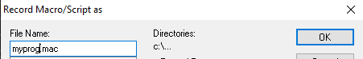
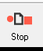

אם אתם מתכנתי קובול במיינפריים, אתם ודאי מכירים את השגרה: מתחילים עבודה על תוכנית חדשה, ומיד פותחים את אותם ארבעה-חמישה מסכים קבועים. מסך לעריכת הקוד, מסך ל-JCL של הקומפילציה, מסך ל-JCL של ההרצה, ומסך לבדיקת מצב הג'ובים.

הפעולה הזו חוזרת על עצמה פעמים רבות במהלך יום עבודה, ובכל פעם אתם מקלידים מחדש פקודות כמו TSO, ISPF, START ועוד. זה מייגע, זה לוקח זמן, וזה פותח פתח לטעויות הקלדה.

**אבל מה אם הייתי אומר לכם שאתם יכולים לפתוח את כל המסכים האלה בלחיצת כפתור אחת, ובתוך שניות בודדות?**

ברוכים הבאים לעולם המאקרו ב-IBM Personal Communications (PCOMM)!

## מה זה בכלל IBM Personal Communications (PCOMM)?

לפני שנצלול פנימה, בואו נבין רגע מה זה PCOMM.

**IBM Personal Communications (PCOMM)** היא תוכנת אמולציית מסוף שאתם כנראה משתמשים בה (Terminal Emulator). היא מאפשרת למשתמשי מחשבים אישיים (PC) להתחבר למערכות המיינפריים, לגשת אליהן ולבצע עליהן. זה השער שלכם לעולם המיינפריים.

אחת היכולות החזקות והפחות מנוצלות ב-PCOMM היא היכולת להקליט ולהריץ מאקרואים. **מאקרו הוא למעשה רצף של פקודות ופעולות שהקלטתם מראש**. במקום לבצע כל פעולה ידנית, המאקרו עושה זאת עבורכם באופן אוטומטי ומהיר.

## הדגמה פרקטית: פתיחת סביבת עבודה ב-PCOMM בלחיצת כפתור

בואו נניח שאתם מתחילים לעבוד על תוכנית קובול ספציפית, נניח `MYPROG`. אתם זקוקים מיד למסכים הבאים:

- **מסך עריכת קוד**: כדי לערוך את הקוד של MYPROG ב-ISPF Edit
- **מסך JCL קומפילציה**: כדי לצפות או לערוך את ה-JCL שמקמפל את MYPROG
- **מסך JCL הרצה**: כדי לצפות או לערוך את ה-JCL שמריץ את MYPROG לאחר הקומפילציה
- **מסך מצב ג'ובים (SDSF)**: כדי לנטר את סטטוס הקומפילציה וההרצה של הג'ובים שלכם

במקום לפתוח כל מסך בנפרד, להקליד את הפקודות והשמות המתאימים, אנחנו נקליט את כל הרצף הזה למאקרו אחד!

## איך מקליטים מאקרו ב-PCOMM?

התהליך פשוט למדי:

### 1. התחילו את הקלטת המאקרו

בחלון ה-PCOMM הפעיל שלכם, חפשו את תפריט **Macro** ובחרו **Record**:


תיפתח חלונית קטנה, בחרו שם קובץ למאקרו שלכם (לדוגמה: `myprog.mac`) ולחצו על OK:



> **שימו לב**: מעתה, כל פעולה שתבצעו תוקלט.

### 2. בצעו את הפעולות הנדרשות לפתיחת המסכים

הקלידו את הפקודות הנדרשות כדי לפתוח את כל המסכים הנדרשים לכם, למשל:

<div dir="ltr">

```
VIEW MY.DATA.SET(MYPROG)
SCRNAME PRGRM
START
VIEW MY.DATA.SET(COMPILE)
SCRNAME COMP
START
VIEW MY.DATA.SET(RUNPROG)
SCRNAME RUNJCL
START
S;ST
SCRNAME STATUS
START
```
</div>

### 3. סיימו את הקלטת המאקרו

לאחר שפתחתם וסידרתם את כל המסכים כרצונכם, לחצו על כפתור **Stop** באותו תפריט:



## איך מריצים את המאקרו?

בפעמים הבאות, כשאתם רוצים לפתוח את כל המסכים עבור `MYPROG`:

1. נווטו לתפריט **Macro**
2. בחרו באפשרות **Play**
3. בחרו את המאקרו שאתם רוצים להריץ

**בתוך שניות, כל המסכים ייפתחו ויופיעו על המסך שלכם, מוכנים לעבודה!**

### 💡 טיפ מתקדם: הקצאת צירוף מקשים

אתם יכולים גם להקצות צירוף מקשים (Hot Key) למאקרו שלכם לגישה מהירה עוד יותר, דרך תפריט מיפוי המקשים ב-PCOMM.

---

## לסיכום

היכולת להקליט ולהריץ מאקרואים ב-IBM Personal Communications היא כלי עוצמתי ופשוט שכל מתכנת מיינפריים כדאי שיכיר.

### 🎯 היתרונות העיקריים:

- ⏰ **חיסכון בזמן יקר**
- 🎯 **הפחתת טעויות הקלדה**
- 📈 **שיפור דרמטי של הפרודוקטיביות היומית**

במקום לבזבז דקות יקרות על פתיחת מסכים, תתחילו מיד לעבוד על מה שבאמת חשוב – **כתיבת קוד!**

---

**💬 איזה מאקרו אתם הולכים להקליט היום כדי לייעל את עבודתכם? שתפו אותנו בתגובות!**

