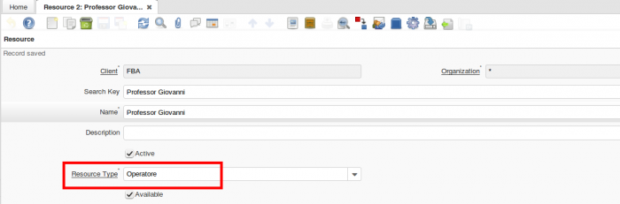
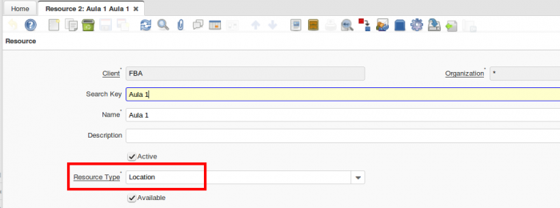
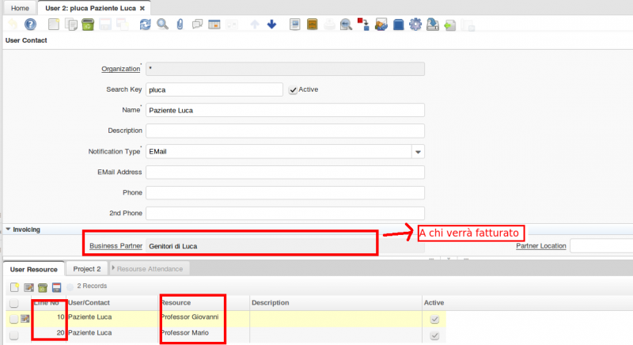
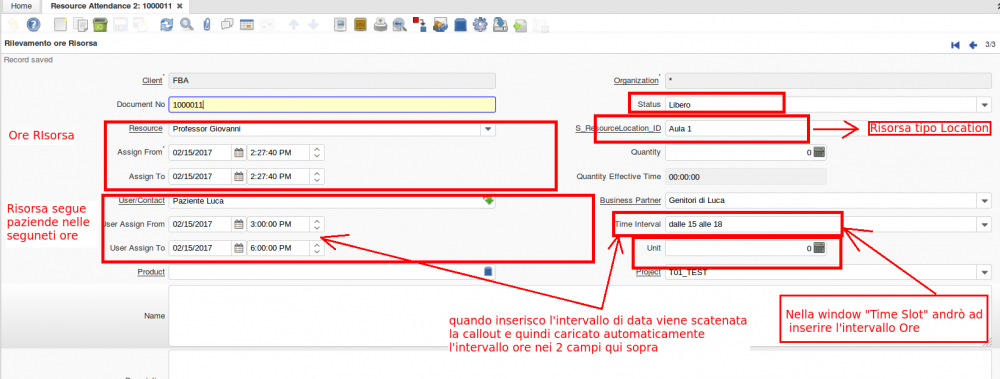

## ESEMPIO: Attività educativa Scolastica ed extrascolastica

Supponiamo che un Operatore (che chiameremo Risorsa) debba seguire uno o più Pazienti (che chiameremo Utente) all'interno di una qualsiasi sede educativa (ad es: scuola, ospedale, centri riabilitazione, assistenza persone con deficit,ecc... ). Ecco che avremmo bisogno di gestire al meglio il nostro calendario (gestire le ore dell'Operatore, gestire le Ore del Paziente, assegnare l'operatore al Paziente, controllare la disponibilità degli operatori nel caso che un altro operatore sia ammalato o impegnato con altri pazienti, ecc...).

Vediamo come in Idempiere può essere gestita questa cosa:

Ci baseremo principalmente sull'utilizzo di queste seguenti window:

```
1) Resouce 2 (Risorsa) 
2) User 2 (Utente)
3) Project 2 (Progetto)
4) Resource Attendance 2 (Rilevamento Ore)
```

Il numero "2" sta a significare che queste maschere sono una copia delle maschere originali (in modo tale che vengano modificate solamente queste copie per non creare problemi ad aggiornamenti plugin, ecc,ecc...).

Vediamo ora singolarmente come queste window vengono gestite:

---

## 1) Resouce 2 (Risorsa)

In questa maschera andremo ad inserire il tipo di Operatore, ovvero la Risorsa che lavora nella nostra scuola, ospedale,ecc... ma NON SOLO, qui possiamo inserire anche la Location, che può essere  per esempio un'aula (aula A, aula B, aula C, ecc...).





---

## 2) User 2 (Utente)

In questa maschera andremo ad inserire l'Utente (ovvero il paziente, l'alunno, il degente, ecc...). 

All'Utente possiamo associare uno o più operatori che lo seguono (nel caso di più risorse, la risorsa con "Line" minore avrà priorità sulle altre).
Inoltre, possiamo associare un progetto all'Utente (la Tab Progetto la possiamo vedere nella sezione successiva "Project 2")



---

## 3) Project 2 (Progetto)

In questa maschera andremo ad inserir il Progetto a cui è inserito l'Utente.

Nella SottoTab "ProjectLine" andremo ad inserire un Prodotto, nel nostro caso sarà un tipo Servizio (ad esempio Educativa, Diagnostica, ecc...)

La SottoTab Resource Attendance la vedremo nella sezione successiva


---

## 4) Resource Attendance 2 (Rilevamento Ore)

In questa maschera sono stati aggiunti diversi campi (Non presenti attualmente nel plugin delle Resource Attendance).

```
Status (ad esempio Non Disponibile, Libero, Reperibile)
ResourceLocation (esempio Aula A, Aula B, Aula C,...)
UserAssignFrom
UserAssignTo
Time Interval (nella tabella "Time Slot" definisco l'intervallo di ora,  quando poi seleziono questo campo verrà scatenata una callout che caricherà automaticamente l'intervallo ore nei 2 campi qui sopra)
Unit (unità utente, ad esempio 40 minuti=1 unità)
```

In questa maschera andremo ad inserire le Ore della Risorsa  con il relativo intervallo di ore del Paziente (Utente), ovvero la Risorsa può essere disponibile dalle 08:00 alle 13:00 ma seguire il paziente dalle ore 09:00 alle 11:00. Quindi ho bisogno di gestire l'intervallo di ore con cui la risorsa seguirà l'utente. Per questo sono stati aggiunti i campi "User Assign From", "User Assign To".



Come si può vedere dalla foto qui sopra, i due campi "User Assign From" e "User Assign To" possono essere inseriti manualmente in questa maschera oppure inserendo un intervallo di ore presente nel campo "Time Interval" (ovviamente l'intervallo caricherà automaticamente l'ora nei due campi "User Assign From" e "User Assign To")

Nella window "Time Slot" posso gestire gli intervalli di ore dell'utente, in modo che poi possano comparire nel mio campo "Time Interval" (vedi foto appena sopra)

