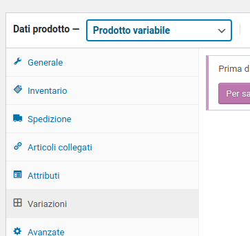
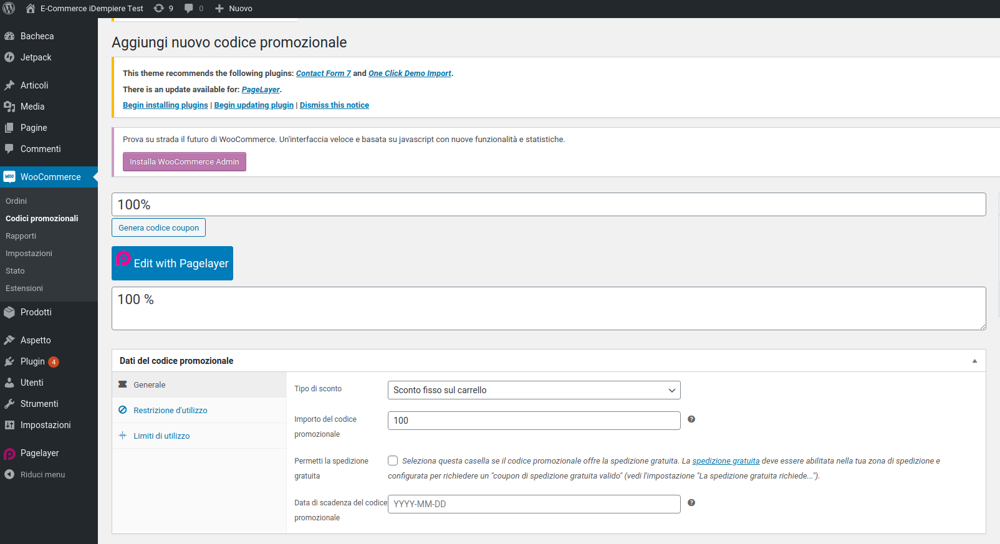
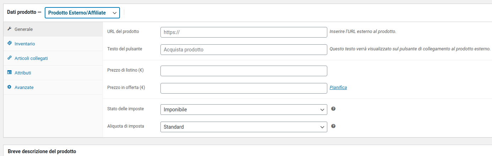
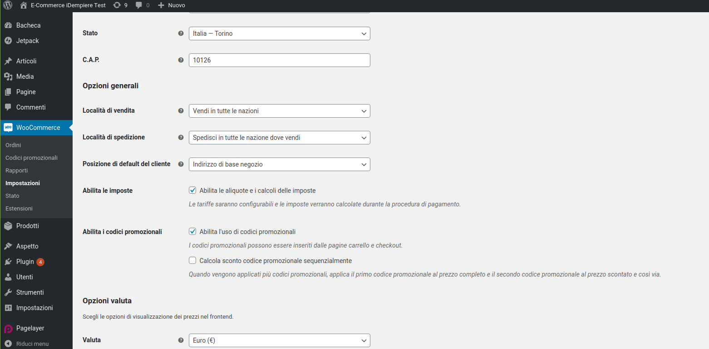

VIDEO - "Getting to Grips with WooCommerce in WordPress"

* (!) Per prodotti scaricabili/virtuali (esempio plug-in idempiere…): dopo ricezione del pagamento attivare un processo che installi il plug-in su proprio server????

* Email -------> Dedicated SMTP Providers (....plugins)  [video 2_4]

* Certificato SSL --------> free SSL [video 2_5  +  video 2_6] 

* Es. New Plugin = "Really Simple SSL"

* Gestione delle varianti dei prodotti, in base agli attributi di un prodotto [video 3_5]
Creazione di "sottoprodotti" nelle varianti….

N.B. questa gestione manca su plug-in LIT_ECommerce

* Sottoscrizioni / Abbonamenti [video 3_7]
Plugin = "YITH WooCommerce Subscription"  **_(? come gestire a livello di plug-in LIT_ECommerce… ????)_**

* Gestione dei Coupon e prodotti di tipo download, una volta pagati [video 3_8]
Menu WooCommerce>Codici promozionali

**_(? come gestire a livello di plug-in LIT_ECommerce… ????)_**

* Gestione Prodotto Esterno/Affiliate ------> si può mettere il link ad esempio di un prodotto presente su Amazon…. redirect al sito….
[video 3_9]

* Settaggi configurazione pagamenti via PayPal
[video 4_2]
Per fare delle prove di paypal_Sandbox + api token da registrare su WooCommerce, usare utenza *[checchia.andrea@consul-net.i*t](mailto:checchia.andrea@consul-net.it)* / pwd: cecchia_2015*
Guida per settaggi su wooCommerce:

[https://docs.woocommerce.com/document/paypal-standard/](https://docs.woocommerce.com/document/paypal-standard/)

* Settaggi configurazione pagamenti per carte di credito via Stripe
[video 4_3]
Plugin = "WooCommerce Stripe Payment Gateway" by WooCommerce
Avere un account Stripe

* Apple Pay sempre via Stripe
[video 4_5]

* I video "video 5_*", sono relativi al settaggio delle tasse su woocommerce….. in teoria tutto gestito da iDempiere (???)

* I video "video 6_*", sono relativi al settaggio delle spedizioni su woocommerce….. in teoria tutto gestito da iDempiere (???)

* I video "video 7_*", sono relativi alla gestione degli ordini su woocommerce….. in teoria tutto gestito da iDempiere (???)
° Ordini da rifiutare e restituzione del pagamento [video 7_4]  **_(? come gestire a livello di plug-in LIT_ECommerce… ????)
_**° Utilizzo e gestione dei Coupons [video 7_5] -------> abilitare il flag sotto “WooCommerce > Impostazioni> Generali”

