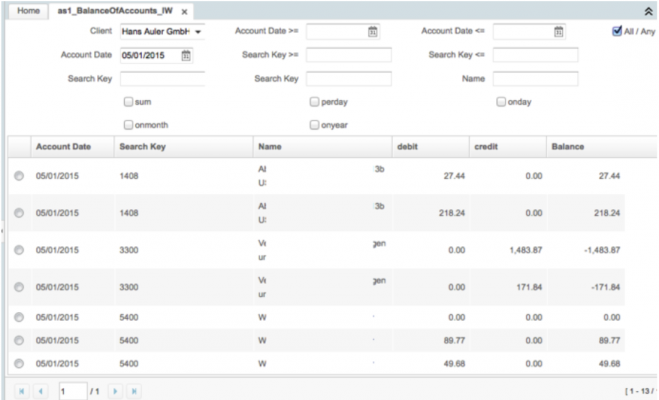
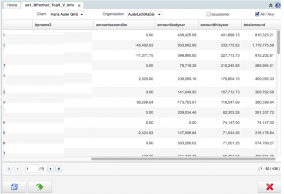

# Plugin: Account Info (STD)

---

## link esterni

---

## Riferimenti

*link pubblico          : http://wiki.idempiere.org/en/Plugin:_AulerAccountsInfo
*link idempeire italia  : na ( 2pack )
*link jar               : /opt/repos/idempiere-download/plugin-standard/Auler Accounts Info/
*versione idempiere     : idempiere 3.1
*versione zk supportata : na

---

## Descrizione

Un altro tipo di windows Account Info
Permettere la selezione data multipla 
Consente fino a tre distintivi criteri di impostazione
Info window altamente modificabile

---

## Installazione

VERSIONE AGGIORNATA --> /opt/repos/idempiere-download/plugin-standard/Auler_Accounts_Info/ e lanciare il 2pack_AulerInfoAccounts.zip
OLD --> Prima di tutto lanciare lo script sql (collegarsi con pgAdmin o phpPgAdmin per caricare lo script sql) dopodichè carico il 2pack

---

## Parametrizzazione Plugin

---

## Istruzioni Plugin

---

## Documentazione Tecnica Plugin

---

## Modifiche all'AD 

### Tables / Windows esistenti

### Nuove Tables /Windows

---

## Funzionalità Future

---

## Errori e bug

---

