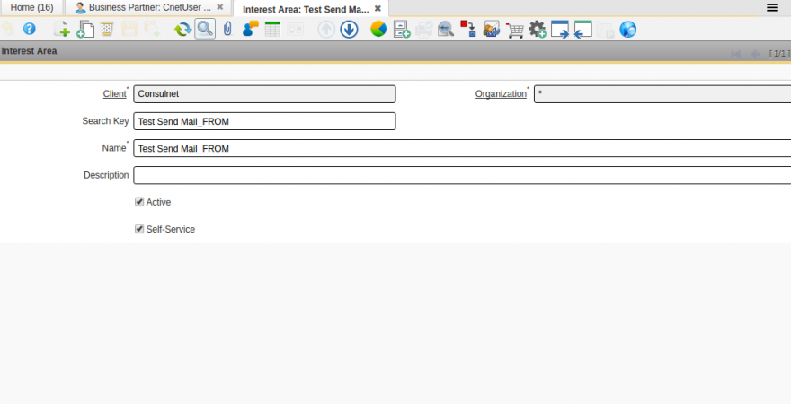
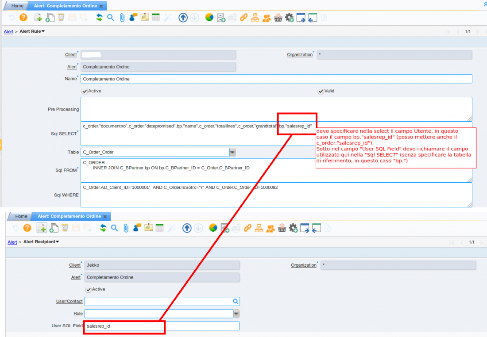

# Plugin Send Mail

---

## Riferimenti

 http://www.benchmarkemail.com/it/resources/Free-HTML-Email-Templates

*link pubblico          : 
*link idempeire italia  : 
*link jar               : 
*versione idempiere     : idempiere 4.1
*versione zk supportata : zk8

---

## Descrizione Plugin

I processi di questo plug-in permettono la gestione di sottoscrizioni di utenti su determinate aree di interesse e il successivo invio della mail.

Installare nella console felix il jar reperibile su [https://bitbucket.org/consulnet/idempiere-download idempiere-download]

'''Nome plug-in:''' ''it.cnet.impl.LIT_SendMail.jar''

---

## TODO

 (vedi chat Telegram idempiere consulting --> 3 gennaio 2017)
 Plug_in Send Mail:
 1) Togliere il Processo Jasper come obbligatorio (da window Send Mail Parameter
 2) IL processo prende il path del Report (errato) —> attachment:jasperxxxx.jasper

---

## Parametrizzazione Plugin

Per far funzionare i processi del plug-in, bisogna, come base, settare alcuni dati principali:

Creare un tipo di contatto nella maschera '''''LIT Tables''''', per raggruppare tipi di utenti per una determinata area di interesse   

Settare il tipo contatto agli utenti (Users) di un determinato Bussiness Partner; inoltre verificare che gli utenti abbiano l'Email Address valorizzato  

Creare una determinata Interest Area per l'invio mail ed Associarla ad ogni utente che si vuole:

definizione di un'area d'interesse (Interest Area)  

associazione dell'area d'interesse all'utente  

Molto IMPORTANTE è la maschera '''''Send Email Parameter''''': in questa maschera c'è la parametrizzazione per il corretto funzionamento del plug-in.  

* *Table*: nome della tabella da dove reperire il record da stampare sul report
* *Column*: principalmente il campo dove reperire i contatti/utenti da registrare nell'Interest Area
* *Interest Area*: 
* *Process*: il jasper report da allegare alla mail
* *Contact Type Group*: il tipo contatto da reperire per l'invio mail
* *Sales Lead*: se c'è il flag, significa che va a recuperare tutti i contatti/user, indipendentemente se sono associati ad un bpartner o no

5. POIIIII

## Istruzioni Plugin

Il Send Mail è suddiviso in 2 fasi:

(Processo 1) '''''Append mail''''': reperire tutti i contatti/users di una determinata Interest Area e associarli ad Interest Area di destinazione invio mail; per fare questo, bisogna creare delle InfoWindow basate su tabelle che si vogliono utilizzare per l'invio delle mail. 

  
IMPORTANTE: nel SQL From mettere il giusto ID del ContactTypeGroup... (TODO....)

 

(Processo 2) '''''Send mail''''': una volta raccolti i contatti che servono, c'è l'invio vero e proprio della mail: costituisce una mail la composizione di un Mail Template + l'invio di un report PDF

## Estensione ALERT

In questo plugin è stata aggiunta un estensione agli ALert, ovvero l'invio degli alert in base anche agli userID dichiarati nella SELECT dell'AlertRule

Nella window Alert --> inserire un filtro di invio nell' "Alert Recipient"  (Aggiunto campo "User SQL Field") che prenda ad esempio non solo degli utenti fissi ma Sales Representative degli Ordini completati (dichiarati nella SELECT dell'Alert Rule)

Vediamo un esempio:

