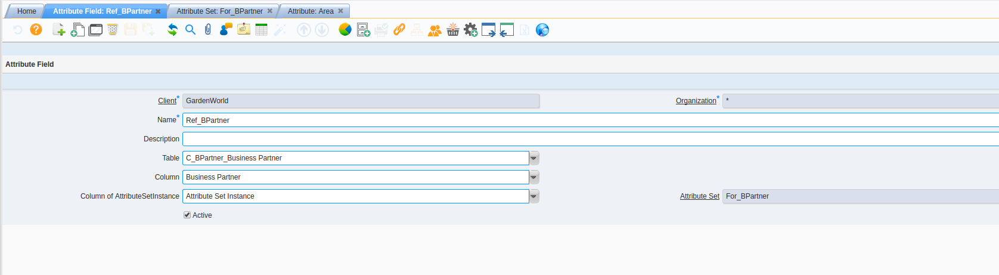
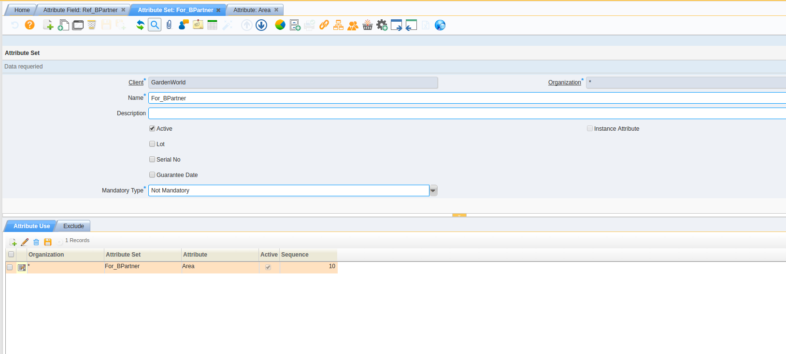
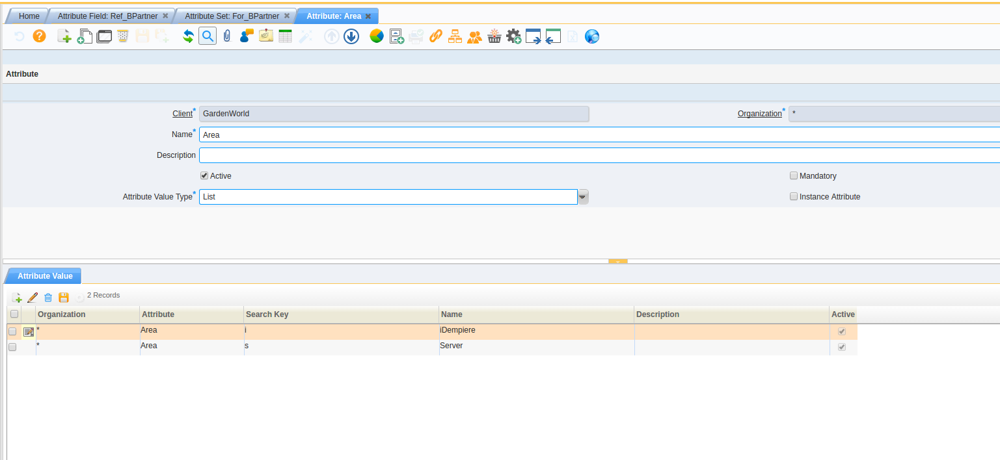
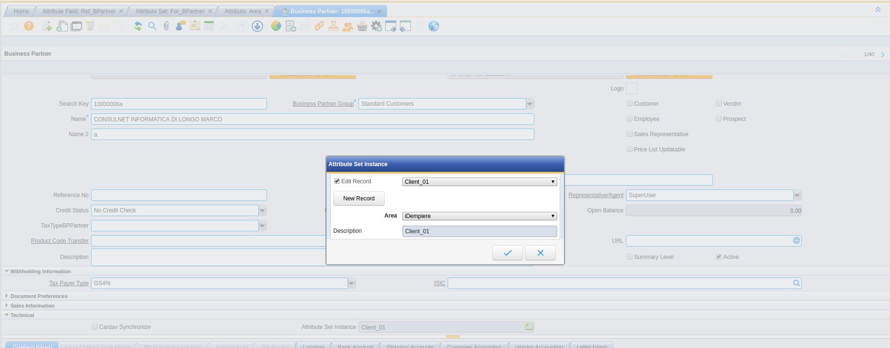

# Plugin Warehouse Extend

---

## Descrizione Plugin

---

## Funzionalità supportate

### Attribute on All Table

Gestione dell'attributeSetInstance in tutte le window, secondo parametrizzazione della nuova maschera/window  "Attribute Field".
</br>

---

1. Bisogna avere un campo M_AttributeSetInstance_ID impostato/creato sulla tabella che vogliamo gestire con gli attributSet.

2. Nella maschera/window  "Attribute Field", si deve parametrizzare 

3. la tabella dove abbiamo messo il campo "M_AttributeSetInstance_ID" creato

4. il campo ID della tabella, che viene specificato sotto forma di field (ad esempio: tabella '''C_BPartner''' --> Column '''Business Partner''' )

5. il campo "Attribute Set Instance" presente a tabella e il relativo "Attribute Set" da associare.

</br>
</br>
</br>
</br>
</br>
</br>
</br>
</br>
**Risultato della parametrizzazione:**
</br>


## Installazione Plugin

---

## Parametrizzazione Plugin

---

## Istruzioni Plugin

---

## Documentazione Tecnica Plugin

N.B: per l'utilizzo della gestione "6Pack", è importante avere il plug-in 

```
de.bxservice.relatedproduct
```

 attivo; alcune funzionalità gestite inizialmente nel WarehouseExtend sono state spostate nel relatedProduct

### Modifiche all'AD

#### Existing Tables / Windows

#### New Tables /Windows

#### Removed Tables /Windows

---

## Funzionalità Future

---

## Errori e bug

---