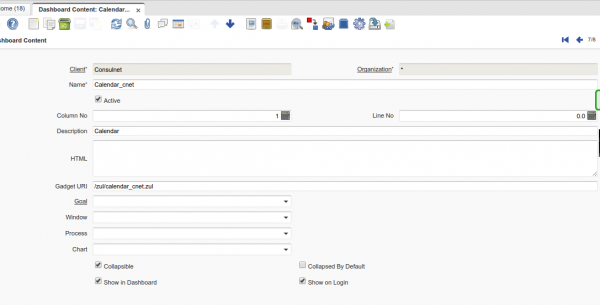
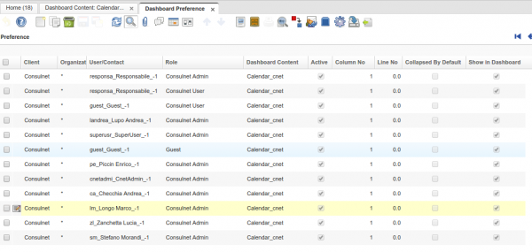

# Creazione Calendario

---

A livello client, impostare il tipo zul calendar creato:
entrare come SuperUser e selezionare il Client che si desidera il calendario;
da menu system admin > Organization Rule maschera "Dashboard Content" impostare il campo Gadget URI con il seguente dato:

```
/zul/calendar_cnet.zul
```

E' possibile impostare il "Nome" piacimento



E' inoltre possibile impostare nello stesso momento un secondo calendario:

```
/zul/calendar_cnet2.zul
ADESSO LIMITATO A DUE SOLI CALENDARI
```

Dopo, impostare i ruoli degli utenti per la visualizzazione del calendario sulla proprio dashboard

Da menu System Admin > Organization Rule maschera "Dashboard Preference"


Si può creare più ruoli per lo stesso Dashboard Content creato, come da esempio:



Fare logout, e rientrare nel client.
Risultato:

