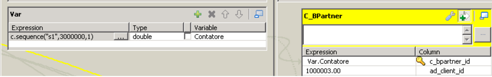
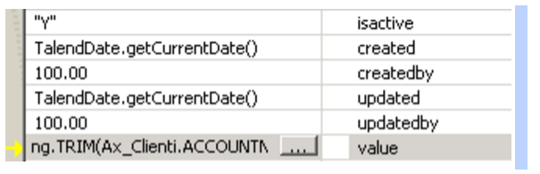

---
title: "How to Talend"
date: 2020-04-24T22:47:10+02:00
draft: false
weight : 500
pre: "<b></b>"
--- 

## Talend Tip & Trick

```
 https://www.talendforge.org/tutorials/tutorial.php?language=english&idTuto=1#step1
 https://www.talendforge.org/tutorials/tutorial.php?idTuto=9
 https://www.talendforge.org/tutorials/menu.php
```

Web Services 

```
https://www.talendforge.org/tutorials/tutorial.php?idTuto=38
https://help.talend.com/display/KB/Calling+a+Web+service+in+Talend+Studio?thc_login=done
https://www.talendforge.org/tutorials/tutorial.php?language=English&idTuto=104 
http://stackoverflow.com/questions/14749634/expose-talend-etl-job-as-a-web-service
```

```
Component for Compiere http://sourceforge.net/projects/talendcompierec/?source=navbar
```

Contatore

```
 row1.PostalCode.toUpperCase()
 row1.PostalCode == null ? null : row1.PostalCode.length() == 0 ? null : row1.PostalCode.toUpperCase()
```



updated updateby created createdby



BigDecimal -> Double 


StringHandling.LEFT(Ax_Clienti.URL , 120) 
StringHandling.TRIM(Ax_Clienti.ACCOUNTNUM) 

TalendDate.parseDate("yyyy-MM-dd HH:mm:ss", TalendDate.formatDate("yyyy-MM-dd", ddt_ax.DDT_R_CREATEDDATE) + " " + Var.Ore + ":"+ Var.Min + ":" +  Var.Sec )   


ddt_ax.DDT_R_QTY.doubleValue()  

Int(row1.cond_stufe_allarm)==0 ? "Y":"N"
