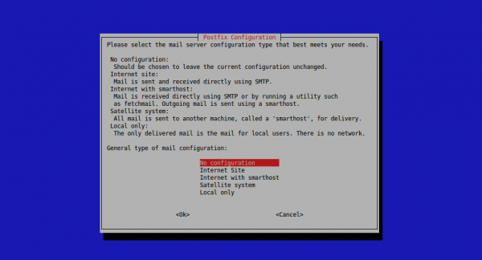
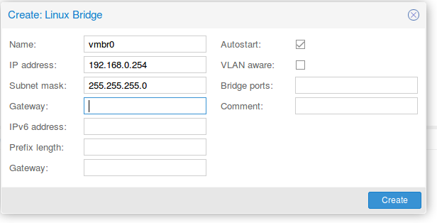

**Installazione PROXMOX**

```
https://pve.proxmox.com/wiki/Install_Proxmox_VE_on_Debian_Jessie
```

Install Proxmox VE

```
echo "deb http://download.proxmox.com/debian jessie pve-no-subscription" > /etc/apt/sources.list.d/pve-install-repo.list
wget -O- "http://download.proxmox.com/debian/key.asc" | apt-key add -
apt-get update && apt-get dist-upgrade
apt-get install proxmox-ve ssh postfix ksm-control-daemon open-iscsi systemd-sysv
```

Subito dopo ci comparirà la Configurazione (premere su "No configuration")



Dopo aver completato l'installazione di Proxmox possiamo accedere via web al seguente indirizzo:

```
https://youripaddress:8006/
```

Creiamo il Linux Bridge:




Adesso andiamo a configurare il file /etc/network/interfaces

IMPORTANTE: Nel seguente file interfaces dobbiamo commentare la seguente riga ed aggiungerne
#up ip route replace ......91.0/255.255.255.0 via ......91.1 dev eth0
up route add -net ......91.0/24 gw .......91.1 dev eth0

## Modificare Nome CT

```
/etc/pve/nodes/<host-server-name>/lxc
```

- rinominare file

eseguire nano 

```
arch: amd64
cores: 2
hostname: wiki
memory: 2048
net0: name=eth0,bridge=vmbr0,gw=192.168.0.254,hwaddr=CA:AF:60:29:F5:64,ip=192.168.0.51/24,type=veth
ostype: debian
rootfs: local:151/vm-151-disk-1.raw,size=20G
swap: 2048
```

- modificare riga rootfs  2 volte

## Modficare Hd

```
/var/lib/vz/images/
```

directory dei backup  /var/lib/vz/dump     

- rinominare cartella
-rinominare file

## Modficare Data

IMPORTANTE -- in un nuovo container impostare il timezone

```
dpkg-reconfigure tzdata
```

## Restore Container da linea di comando

COUNTER=Numero del container

```
cd /var/lib/vz/dump/
pct restore 1$COUNTER template-lxc-idempiere_ita_demo-142.tar.lzo
pct set 1$COUNTER -hostname $NOME_CONTAINER$COUNTER
pct set 1$COUNTER -net0 name=eth0,bridge=vmbr0,ip=192.168.0.$COUNTER/24,gw=192.168.0.254
pct start 1$COUNTER
```

## Resize Container

```
pct restore 112 /var/lib/vz/dump/vzdump-lxc......tar.lzo  --rootfs local:10
```

dil Container viene impostato con un size di 10 Giga    

## Backup DB + Application Idempiere

In ogni Container sono stati inseriti 2 Backup:

1) uno riguardante il backup del Database (viene creato il jar e copiato in un container remoto nella seguente directory /opt/Backup/bck_DB). Questo script viene lanciato giornalmente (circa alle 23) e utilizza la rotazione nonno-genitore-figlio, ovvero vengono "tenuti in memoria":

```
- i backup degli ultimi 6 giorni (dal lunedì al sabato)
- un backup alla settimana (eseguito la domenica - e quindi 4 backup al mese)
- un backup ogni primo del mese (solo degli ultimi 4 mesi)
- un backup ogni primo dell'anno (solo degli ultimi 2 anni)
```

2) uno riguardante il backup dell'Application "idempiere-server"(viene compressa la cartella in .tgz - tranne i bck presenti all'interno della cartella data - e copiato in un container remoto nella seguente directory /opt/Backup/bck_Application). Questo script viene lanciato ogni primo del mese (circa alle 22) e utilizza la rotazione nonno-genitore-figlio, ovvero vengono "tenuti in memoria":

```
- i backup degli ultimi 5 mesi (ogni primo del mese)
- un backup ogni primo dell'anno (solo degli ultimi 2 anni)
```

Se premiamo il comando "crontab -e" possiamo vedere i Backup che vengono lancati: 

```
40 23 * * * /opt/idempiere/script_Backup/Backup_Database.sh-->Backup del DB lanciato alle 23e40
40 22 * * * /opt/idempiere/script_Backup/Backup_Application.sh-->Backup dell'Application lanciata alle 22e40
```

