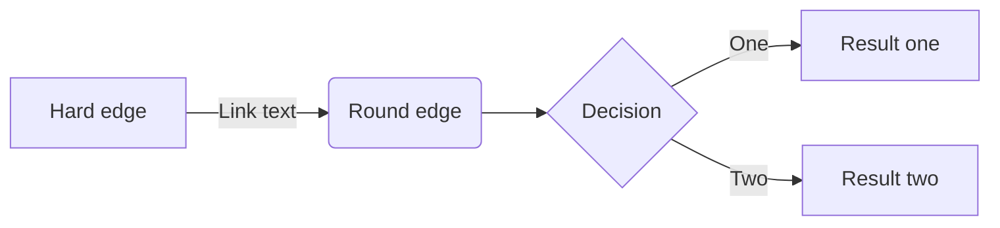
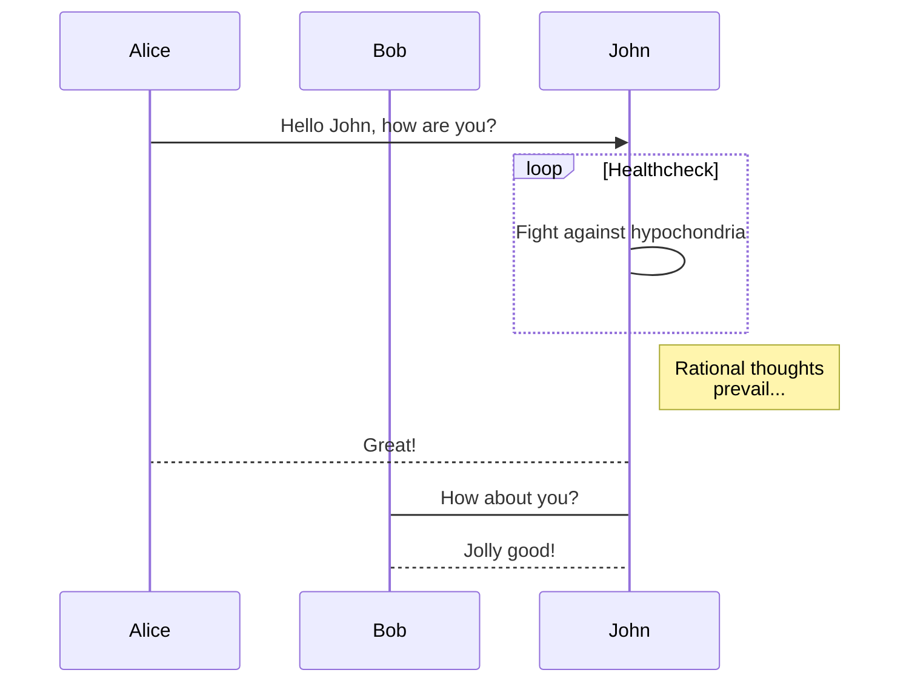
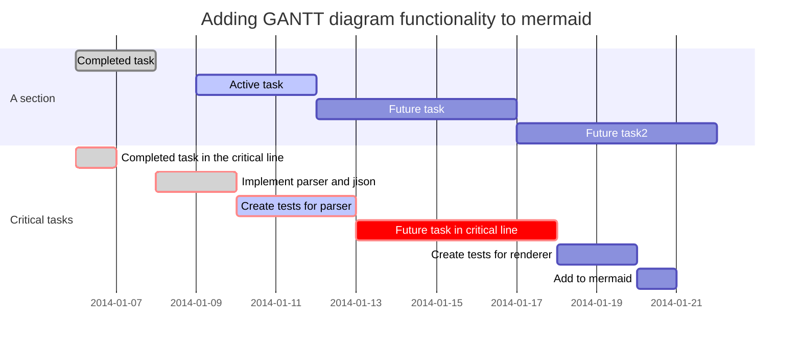
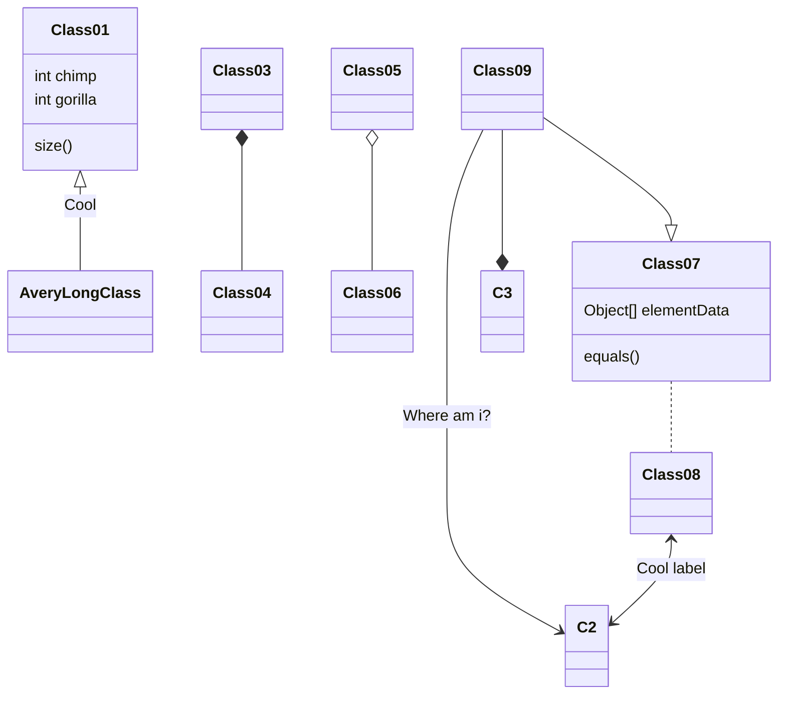

# iDempiere Documentazione Utente

Hugo 

Hugo server -D   ( show also Draft Pages)

hugo new filename.md

hugo new dir/filename.md

```toml
[params]
title: "a"
date : 2017-01-01
draft: true
weight: 10
tags : ["test","due"]
categories: ["cat"]
```


Esempio link [Hugo-theme-learn](http://github.com/matcornic/hugo-theme-learn)
ESempio grassetto **fully designed for documentation**.


##  Esempio Paragrafo '##'


Esempio Elenco puntato

* [Automatic Search]({})
* [Multilingual mode]({})
* **Unlimited menu levels**


Esempio Immagine


```toml
[params]
  # Prefix URL to edit current page. Will display an "Edit this page" button on top right hand corner of every page.
  # Useful to give opportunity to people to create merge request for your doc.
  # See the config.toml file from this documentation site to have an example.
 with a variant one. Can be "red", "blue", "green".
  themeVariant = ""
  # Provide a list of custom css files to load relative from the `static/` folder in the site root.
  custom_css = ["css/foo.css", "css/bar.css"]
```


### Notice

Esempio note
{}
Automatically published and hosted thanks to [Netlify](https://www.netlify.com/). Read more about [Automated HUGO deployments with Netlify](https://www.netlify.com/blog/2015/07/30/hosting-hugo-on-netlifyinsanely-fast-deploys/)
{}

Esempio Tip
{}Learn theme works with a _page tree structure_ to organize content : All contents are pages, which belong to other pages. [read more about this]({}) 
{}


Esempio Notice info
{}
Your modification will be deployed automatically when merged.
{}


Esempio Notice warning
{}
Your modification will be deployed automatically when merged.
{}

### SiteParam

## Documentation website
Esempio evidenza + copy to clipboard  : `hugo -t hugo-theme-learn` 
`siteparam` shortcode is used to help you print values of site params. 

For instance, in this current site, the `editURL` variable is used in `config.toml`

```toml
[params]
  editURL = "https://github.com/matcornic/hugo-theme-learn/edit/master/exampleSite/content/"
```

Use the `siteparam` shortcode to display its value.

```
`editURL` Value : {}
```

is displayed as

`editURL` Value : {}

### Mermaid 

---
title : "Mermaid"
description : "Generation of diagram and flowchart from text in a similar manner as markdown"
---

[Mermaid](https://mermaidjs.github.io/) is a library helping you to generate diagram and flowcharts from text, in a similar manner as Markdown.

Just insert your mermaid code in the `mermaid` shortcode and that's it.

## Flowchart example

	
	graph LR;
		A[Hard edge] -->|Link text| B(Round edge)
		B --> C{Decision}
		C -->|One| D[Result one]
		C -->|Two| E[Result two]
	

renders as


graph LR;
	A[Hard edge] -->|Link text| B(Round edge)
	B --> C{Decision}
	C -->|One| D[Result one]
	C -->|Two| E[Result two]


or you can use this alternative syntax:

<pre>

</pre>

renders as


## Sequence example

	
	sequenceDiagram
	    participant Alice
	    participant Bob
	    Alice->>John: Hello John, how are you?
	    loop Healthcheck
	        John->John: Fight against hypochondria
	    end
	    Note right of John: Rational thoughts <br/>prevail...
	    John-->Alice: Great!
	    John->Bob: How about you?
	    Bob-->John: Jolly good!
	

renders as


sequenceDiagram
    participant Alice
    participant Bob
    Alice->>John: Hello John, how are you?
    loop Healthcheck
        John->John: Fight against hypochondria
    end
    Note right of John: Rational thoughts <br/>prevail...
    John-->Alice: Great!
    John->Bob: How about you?
    Bob-->John: Jolly good!


or you can use this alternative syntax:

<pre>

</pre>

renders as


## GANTT Example

	
	gantt
	        dateFormat  YYYY-MM-DD
	        title Adding GANTT diagram functionality to mermaid
	        section A section
	        Completed task            :done,    des1, 2014-01-06,2014-01-08
	        Active task               :active,  des2, 2014-01-09, 3d
	        Future task               :         des3, after des2, 5d
	        Future task2               :         des4, after des3, 5d
	        section Critical tasks
	        Completed task in the critical line :crit, done, 2014-01-06,24h
	        Implement parser and jison          :crit, done, after des1, 2d
	        Create tests for parser             :crit, active, 3d
	        Future task in critical line        :crit, 5d
	        Create tests for renderer           :2d
	        Add to mermaid                      :1d
	


renders as


gantt
        dateFormat  YYYY-MM-DD
        title Adding GANTT diagram functionality to mermaid
        section A section
        Completed task            :done,    des1, 2014-01-06,2014-01-08
        Active task               :active,  des2, 2014-01-09, 3d
        Future task               :         des3, after des2, 5d
        Future task2               :         des4, after des3, 5d
        section Critical tasks
        Completed task in the critical line :crit, done, 2014-01-06,24h
        Implement parser and jison          :crit, done, after des1, 2d
        Create tests for parser             :crit, active, 3d
        Future task in critical line        :crit, 5d
        Create tests for renderer           :2d
        Add to mermaid                      :1d


or you can use this alternative syntax:

<pre>

</pre>

renders as


### Class example

<pre>

</pre>

renders as


### Git example

<pre>

</pre>

renders as


### EXPAND

Esempio Parte visibile / Parte Nascosta
{}Parte Nascosta .{}

### Button

A button is a just a clickable button with optional icon.

    {}Get Grav{}
    {}Get Grav with icon{}
    {}Get Grav with icon right{}

{}Get Grav{}

{}Get Grav with icon{}

{}Get Grav with icon right{}

### Attachment


The Attachments shortcode displays a list of files attached to a page.


#### Usage

The shortcurt lists files found in a **specific folder**.
Currently, it support two implementations for pages

1. If your page is a markdown file, attachements must be place in a **folder** named like your page and ending with **.files**.

    > * content
    >   * _index.md
    >   * page.files
    >      * attachment.pdf
    >   * page.md

2. If your page is a **folder**, attachements must be place in a nested **'files'** folder.

    > * content
    >   * _index.md
    >   * page
    >      * index.md
    >      * files
    >          * attachment.pdf

Be aware that if you use a multilingual website, you will need to have as many folders as languages.

That's all !

### Parameters

| Parameter | Default | Description |
|:--|:--|:--|
| title | "Attachments" | List's title  |
| style | "" | Choose between "orange", "grey", "blue" and "green" for nice style |
| pattern | ".*" | A regular expressions, used to filter the attachments by file name. <br/><br/>The **pattern** parameter value must be [regular expressions](https://en.wikipedia.org/wiki/Regular_expression).

For example:

* To match a file suffix of 'jpg', use **.*jpg** (not *.jpg).
* To match file names ending in 'jpg' or 'png', use **.*(jpg|png)**

### Examples

#### List of attachments ending in pdf or mp4


##    {}

renders as


#### Colored styled box

 //   {}

renders as

 {{/* attachments style="orange" */}}


    {}

renders as 

{{/*% attachments style="grey" /%*/}}

    {}

renders as

{{/*% attachments style="blue" /%*/}}
​    
    {}

renders as

{{/*% attachments style="green" /%*/}}
